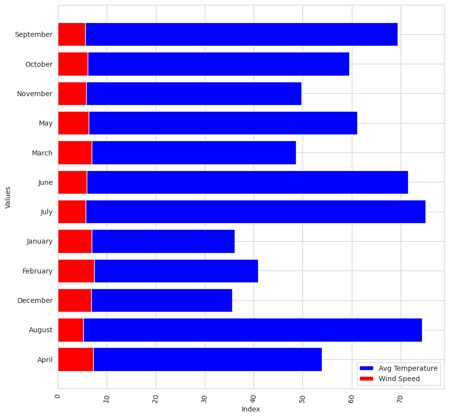
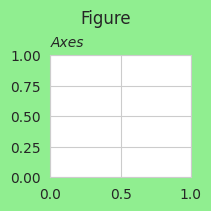
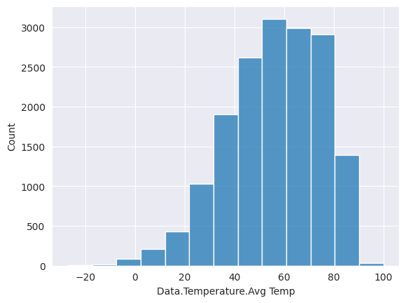
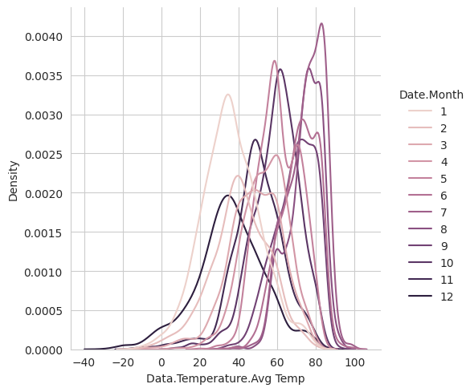
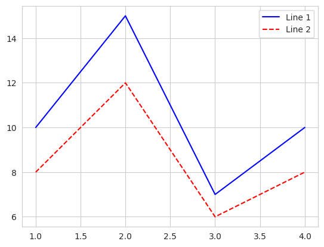

# Learning Image Plot and Matplotlib

## Table of Contents

- [Plotting Basic Graphs](#plotting-basic-graphs)
  - [Bar Graph Using matplotlib](#bar-graph-using-matplotlib)
    - [Changing Color of the plot](#changing-color-of-the-plot)
  - [Multi Bar Graph](#multi-bar-graph)
    - [Rotate x labes](#rotate-x-labes)
    - [Mutli bar on same column](#mutli-bar-on-same-column)
    - [Mutli bar on different column](#mutli-bar-on-different-column)
    - [Plotting Horizontally](#plotting-horizontally)
  - [Scatter Plot](#scatter-plot)
  - [Pie Chart](#pie-chart)
  - [Box Plot using matplotlib](#box-plot-using-matplotlib)
  - [Violin Plot](#violin-plot)
  - [Histograms](#histograms)
    - [Plotting multiple histograms](#plotting-multiple-histograms)
  - [Difference between bar plot and histograms](#difference-between-bar-plot-and-histograms)
- [Subplots](#subplots)
  - [Figure Object](#figure-object)
    - [Figure Parameters](#figure-parameters)
    - [Saving the figure](#saving-the-figure)
  - [Subfigure](#subfigure)
  - [Plotting image](#plotting-image)
- [Seaborn](#seaborn)
  - [Relational Plot](#relational-plot)
    - [Scatter Plot](#scatter-plot-1)
    - [Scatter Plot using Axes level function](#scatter-plot-using-axes-level-function)
    - [Line plot](#line-plot)
  - [Distribution Plot](#distribution-plot)
    - [Histogram Plot](#histogram-plot)
    - [Multiple Histogram](#multiple-histogram)
    - [KDE Plot](#kde-plot)
    - [KDE Plot Along with histogram plot](#kde-plot-along-with-histogram-plot)
  - [Categorical Plot](#categorical-plot)
    - [Bar plot in Seaborn](#bar-plot-in-seaborn)
    - [Count Plot seaborn](#count-plot-seaborn)
    - [Box plot seaborn](#box-plot-seaborn)
    - [Violin Plot Seaborn](#violin-plot-seaborn)
    - [Point Plot Seaborn](#point-plot-seaborn)
    - [Strip Plot Seaborn](#strip-plot-seaborn)
    - [Regression Plot Seaborn](#regression-plot-seaborn)
    - [Heatmap or Correlation Plot](#heatmap-or-correlation-plot)
- [Multi Plot](#multi-plot)
  - [Join Plot](#join-plot)
  - [Pair plot](#pair-plot)
  - [Styling Legends](#styling-legends)
  - [Styling Colors and Styles](#styling-colors-and-styles)
- [References](#references)
 
 


## Plotting Basic Graphs

To plot various graph, I have used weather dataset. The info of the dataset can be found as :


```python
import pandas as pd
import numpy as np
import matplotlib.pyplot as plt
```


```python
df = pd.read_csv('/home/swodesh/Documents/EKbana/swodeshsharma/Task17_Image_plot/weather.csv')
```


```python
df.info()
```

    <class 'pandas.core.frame.DataFrame'>
    RangeIndex: 16743 entries, 0 to 16742
    Data columns (total 14 columns):
     #   Column                     Non-Null Count  Dtype  
    ---  ------                     --------------  -----  
     0   Data.Precipitation         16743 non-null  float64
     1   Date.Full                  16743 non-null  object 
     2   Date.Month                 16743 non-null  int64  
     3   Date.Week of               16743 non-null  int64  
     4   Date.Year                  16743 non-null  int64  
     5   Station.City               16743 non-null  object 
     6   Station.Code               16743 non-null  object 
     7   Station.Location           16743 non-null  object 
     8   Station.State              16743 non-null  object 
     9   Data.Temperature.Avg Temp  16743 non-null  int64  
     10  Data.Temperature.Max Temp  16743 non-null  int64  
     11  Data.Temperature.Min Temp  16743 non-null  int64  
     12  Data.Wind.Direction        16743 non-null  int64  
     13  Data.Wind.Speed            16743 non-null  float64
    dtypes: float64(2), int64(7), object(5)
    memory usage: 1.8+ MB


```python
df = df.sort_values("Date.Month")
```

Lets change the month with actual names.


```python

replace_dict = {
    1: 'January',
    2: 'February',
    3: 'March',
    4: 'April',
    5: 'May',
    6: 'June',
    7: 'July',
    8: 'August',
    9: 'September',
    10: 'October',
    11: 'November',
    12: 'December'
}
```

To rename the column values we use`.replace(some_dictionary)`


```python
df['Date.Month'] = df['Date.Month'].replace( replace_dict )
```


```python
df['Date.Month'].unique()
```


    array(['January', 'February', 'March', 'April', 'May', 'June', 'July',
           'August', 'September', 'October', 'November', 'December'],
          dtype=object)


### Bar Graph Using matplotlib

Lets find the month with most avg temperature


```python
table = pd.pivot_table(df,index= "Date.Month",values='Data.Temperature.Avg Temp',aggfunc = np.mean)
```
 

```python
months = ['January', 'February', 'March', 'April', 'May', 'June', 'July', 'August', 'September', 'October', 'November', 'December']
table.index = pd.Categorical(table.index, categories=months, ordered=True)
```


```python
table
```


<div>
<style scoped>
    .dataframe tbody tr th:only-of-type {
        vertical-align: middle;
    }

    .dataframe tbody tr th {
        vertical-align: top;
    }

    .dataframe thead th {
        text-align: right;
    }
</style>
<table border="1" class="dataframe">
  <thead>
    <tr style="text-align: right;">
      <th></th>
      <th>Data.Temperature.Avg Temp</th>
    </tr>
  </thead>
  <tbody>
    <tr>
      <th>April</th>
      <td>53.885375</td>
    </tr>
    <tr>
      <th>August</th>
      <td>74.414038</td>
    </tr>
    <tr>
      <th>December</th>
      <td>35.651420</td>
    </tr>
    <tr>
      <th>February</th>
      <td>40.870635</td>
    </tr>
    <tr>
      <th>January</th>
      <td>36.104651</td>
    </tr>
    <tr>
      <th>July</th>
      <td>75.110051</td>
    </tr>
    <tr>
      <th>June</th>
      <td>71.557052</td>
    </tr>
    <tr>
      <th>March</th>
      <td>48.672742</td>
    </tr>
    <tr>
      <th>May</th>
      <td>61.140063</td>
    </tr>
    <tr>
      <th>November</th>
      <td>49.756950</td>
    </tr>
    <tr>
      <th>October</th>
      <td>59.561514</td>
    </tr>
    <tr>
      <th>September</th>
      <td>69.411858</td>
    </tr>
  </tbody>
</table>
</div>


```python
table.index
```


    CategoricalIndex(['April', 'August', 'December', 'February', 'January', 'July',
                      'June', 'March', 'May', 'November', 'October', 'September'],
                     categories=['January', 'February', 'March', 'April', ..., 'September', 'October', 'November', 'December'], ordered=True, dtype='category')


```python
# Putting Title

# Setting fig size
plt.figure(figsize=(10,5))

# Bar graph
plt.bar(table.index,table['Data.Temperature.Avg Temp'] )

# xticks
plt.xticks( rotation = 70)

# x-axis label
plt.xlabel('State')

#y-axis labels
plt.ylabel('Avg Temperature')

plt.title("Average temperature across state")

plt.show()

```


    

    


#### Changing Color of the plot


```python
# Putting Title

# Setting fig size
plt.figure(figsize=(10,5))

# Bar graph
plt.bar(table.index,table['Data.Temperature.Avg Temp'] , color = 'red' )

# xticks
plt.xticks( rotation = 70)

# x-axis label
plt.xlabel('State')

#y-axis labels
plt.ylabel('Avg Temperature')

plt.title("Average temperature across state")

plt.show()
```


    

    


### Multi Bar Graph

Lets find the month with most avg temperature


```python
table = pd.pivot_table(df,index= "Date.Month",values= ['Data.Temperature.Avg Temp','Data.Wind.Speed'],aggfunc = np.mean)
```
 

```python
months = ['January', 'February', 'March', 'April', 'May', 'June', 'July', 'August', 'September', 'October', 'November', 'December']
table.index = pd.Categorical(table.index, categories=months, ordered=True)
```


```python
table
```


<div>
<style scoped>
    .dataframe tbody tr th:only-of-type {
        vertical-align: middle;
    }

    .dataframe tbody tr th {
        vertical-align: top;
    }

    .dataframe thead th {
        text-align: right;
    }
</style>
<table border="1" class="dataframe">
  <thead>
    <tr style="text-align: right;">
      <th></th>
      <th>Data.Temperature.Avg Temp</th>
      <th>Data.Wind.Speed</th>
    </tr>
  </thead>
  <tbody>
    <tr>
      <th>April</th>
      <td>53.885375</td>
      <td>7.258885</td>
    </tr>
    <tr>
      <th>August</th>
      <td>74.414038</td>
      <td>5.204629</td>
    </tr>
    <tr>
      <th>December</th>
      <td>35.651420</td>
      <td>6.768052</td>
    </tr>
    <tr>
      <th>February</th>
      <td>40.870635</td>
      <td>7.402317</td>
    </tr>
    <tr>
      <th>January</th>
      <td>36.104651</td>
      <td>6.920301</td>
    </tr>
    <tr>
      <th>July</th>
      <td>75.110051</td>
      <td>5.663753</td>
    </tr>
    <tr>
      <th>June</th>
      <td>71.557052</td>
      <td>5.866593</td>
    </tr>
    <tr>
      <th>March</th>
      <td>48.672742</td>
      <td>6.952750</td>
    </tr>
    <tr>
      <th>May</th>
      <td>61.140063</td>
      <td>6.332826</td>
    </tr>
    <tr>
      <th>November</th>
      <td>49.756950</td>
      <td>5.826442</td>
    </tr>
    <tr>
      <th>October</th>
      <td>59.561514</td>
      <td>6.077218</td>
    </tr>
    <tr>
      <th>September</th>
      <td>69.411858</td>
      <td>5.620047</td>
    </tr>
  </tbody>
</table>
</div>


#### Rotate x labes

```python
plt.xticks(rotation= 80) 
```


#### Mutli bar on same column

```python
plt.figure(figsize=(10,6))
plt.bar(table.index, table['Data.Temperature.Avg Temp'], color='blue', label='Avg Temperature')
plt.bar(table.index, table['Data.Wind.Speed'], color='red', label='Wind Speed')
plt.xlabel('Index')
plt.ylabel('Values')
plt.xticks(rotation= 80)  # Rotate x-axis labels by 45 degrees
plt.legend()
plt.tight_layout()  # Adjust layout to prevent overlapping
plt.show()
```


    

    
#### Mutli bar on different column


```python
# Define the width of each bar
bar_width = 0.35

plt.figure(figsize=(10,6))

# Plot the first set of bars
plt.bar(np.arange(len(table.index)), table['Data.Temperature.Avg Temp'], width=bar_width, color='blue', label='Avg Temperature')

# Plot the second set of bars, shifted by the bar width
plt.bar(np.arange(len(table.index)) + bar_width, table['Data.Wind.Speed'], width=bar_width, color='red', label='Wind Speed')

plt.xlabel('Index')
plt.ylabel('Values')
plt.xticks(np.arange(len(table.index)) + bar_width / 2, table.index)  # Adjust x-axis ticks position
plt.xticks(rotation= 80)  # Rotate x-axis labels by 45 degrees
plt.legend()
plt.tight_layout()
plt.show()

```


    

    


#### Plotting Horizontally


```python
# Plotting horizontally
plt.figure(figsize=(10,10))
plt.barh(table.index, table['Data.Temperature.Avg Temp'], color='blue', label='Avg Temperature')
plt.barh(table.index, table['Data.Wind.Speed'], color='red', label='Wind Speed')
plt.xlabel('Index')
plt.ylabel('Values')
plt.xticks(rotation= 80)  # Rotate x-axis labels by 45 degrees
plt.legend()
#plt.tight_layout()  # Adjust layout to prevent overlapping
plt.show()
```


    

    


```python
table = table.sort_index()
```

### Scatter Plot


```python
# Lets scatter plot the average temperature variation 
plt.figure(figsize=(10,6))
plt.plot(table.index, table['Data.Temperature.Avg Temp'], color='blue', label='Avg Temperature')
plt.plot(table.index, table['Data.Wind.Speed'], color='red', label='Avg Wind Speed')
plt.xlabel('Index')
plt.ylabel('Values')
plt.xticks(rotation= 80)  # Rotate x-axis labels by 45 degrees
plt.legend()
plt.tight_layout()  # Adjust layout to prevent overlapping
plt.show()
```


    

    


### Pie Chart


```python
 
plt.figure(figsize=(10, 10))
plt.pie(table['Data.Temperature.Avg Temp'], labels=table.index, autopct='%1.1f%%' )
plt.gca().set_aspect('equal')  # Equal aspect ratio ensures that pie is drawn as a circle

# Place legend outside the pie chart
plt.legend(loc='center left', bbox_to_anchor=(1, 0.5))

plt.show()

```


    

    


### Box Plot using matplotlib

Box plot gives statistical information about the
distribution of numeric data divided into different
groups. It is useful for detecting outliers within each
group.

The lower, middle and upper part of the box represents the 25th, 50th, and 75th
percentile values respectively

The top whisker represents $`Q3+1.5*IQR`$

The bottom whisker represents $`Q1–1.5*IQR`$

Where `IQR` is inter quartile range.

Outliers are shown as scatter points.


```python
 # Box plot
plt.figure(figsize=(7, 5))
df.boxplot(column='Data.Temperature.Avg Temp', by='Date.Month', grid= True , patch_artist = True)
plt.title('Temperature Box Plot by Month')
plt.xlabel('Month')
plt.ylabel('Temperature (°C)')
plt.suptitle('')  # Suppress default title
plt.xticks(rotation=90)  # Rotate x-axis labels for better readability
plt.tight_layout()
plt.show()

```
    

    


**Another Approach For Box Plot**


```python
#dictionary for Temperature of different months
temp_month = {}
for i in df['Date.Month'].unique():
    temp_month[i] = df[df['Date.Month']==i]['Data.Temperature.Avg Temp']
```


```python
plt.figure(figsize= (10,5))
plt.boxplot([x for x in temp_month.values()],tick_labels=[x for x in temp_month.keys()])
#x and y-axis labels
plt.xlabel('Month')
plt.ylabel('Avg Temperature data')
plt.xticks(rotation = 45)
#plot title
plt.title('Analysing temperature of month')
plt.show()
```


    

    


### Violin Plot


```python
plt.figure(figsize= (10,5))
plt.violinplot([x for x in temp_month.values()] ,showmeans= True, showextrema= True )
#x and y-axis labels
plt.xlabel('Month')
plt.ylabel('Avg Temperature data')
# Set x-axis labels
plt.xticks(range(1, len(temp_month) + 1), [i for i in temp_month.keys()], rotation=45)
plt.xticks(rotation = 45)
#plot title
plt.title('Analysing temperature of month')
plt.show()
```


    

    


### Histograms


```python
# Creating Histogram , Lets see the histogram plot of the temperature
plt.figure(figsize= (10,5))
plt.hist(df['Data.Temperature.Avg Temp'] , bins = 50 , rwidth= 0.7)
plt.xlabel('temperatures')
plt.ylabel('Counts')
plt.show()
```


    

    


#### Plotting multiple histograms 


```python

plt.figure(figsize= (10,5))
plt.hist(df['Data.Temperature.Avg Temp'] , bins = 15 , rwidth= 0.8)
plt.hist(df['Data.Temperature.Max Temp'] , bins = 15 , rwidth= 0.8)
plt.xlabel('temperatures')
plt.ylabel('Counts')
plt.title('Temperature counts across Data')
plt.show()
```


    

    


### Difference between bar plot and histograms
`Bar plot` : Used for Categorical Data  
`Histogram` : Used for Continous Data  

## Subplots

### Figure Object

In Matplotlib, the `Figure` object represents the whole figure or window where plots are drawn. It can contain one or more `Axes` objects, each representing an individual plot. The `Figure` object provides methods to customize the overall appearance of the plot, such as size, title, and saving the plot to a file.

Figure is the outermost container for the Matplotlib plot. There can be single or multiple plots called Axes in a figure. Each axes has their own  x and y axis.

To create a plot in Matplotlib, we can start by creating a `Figure` object using `plt.figure()` and then adding one or more `Axes` objects to it using methods like `add_subplot()` or `subplots()`. Each `Axes` object represents a single plot within the figure and is used to set properties like labels, titles, and plot type.

`plt.subplots()` returns the figure and axes.  


```python
fig, ax = plt.subplots(nrows = 1, ncols = 2, figsize = (20,8))

# Plotting in the first axes
ax[0].barh(table.index , table['Data.Wind.Speed'], color = 'red')
ax[0].set_xlabel("Month")
ax[0].set_ylabel("Wind Speed")
ax[0].set_title("Wind Speed Across different month")

# Plotting in the second axes
ax[1].bar(table.index , table['Data.Temperature.Avg Temp'], color = 'green')
ax[1].set_xlabel("Month")
ax[1].set_ylabel("Average Temperature")
ax[1].set_title("Average Temperature Across different month")

plt.xticks(rotation = 30)
plt.suptitle(" Wind and Temperature variation across months")
plt.show()
```


    

    


#### Figure Parameters


    figsize(float, float): These parameter are the width, height in inches.
    dpi : This parameter is the resolution of the figure.
    facecolor : This parameter is the background color.
    edgecolor : This parameter is the border color.
    frameon : This parameter suppress drawing the figure frame.
    clear : This parameter if True and the figure already exists, then it is cleared.


```python
# Changing the background color
fig, ax = plt.subplots(figsize=(2, 2), facecolor='lightgreen', edgecolor = 'red' ,layout='constrained')
fig.suptitle('Figure')
ax.set_title('Axes', loc='left', fontstyle='oblique', fontsize='medium')
```

  
    

    


#### Saving the figure


```python
fig.savefig('empty_plot.png')
```

### Subfigure

This is a figure inside a figure


```python
fig = plt.figure( figsize=(15,5))

# Creating four subfigures
sfigs = fig.subfigures(1, 2, width_ratios=[1, 1])

# Adding subplots to first subfigure:
first_ax = sfigs[0].subplots(2, 1)
sfigs[0].suptitle('First subfigure')

# Add subplots to the last subfigure:
last_ax = sfigs[1].subplots(1, 2)
sfigs[1].suptitle('Last subfigure')

# fig.tight_layout()
# suptitle for the main figure:
fig.suptitle('Sub Figure Practice')
plt.show()
```


    

    


Lets plot different graph in a single figure using subfigure


```python
fig = plt.figure(figsize=(20, 5))

# Creating four subfigures
sfigs = fig.subfigures(1, 2, width_ratios=[1, 1])

# Adding subplots to first subfigure:
first_ax = sfigs[0].subplots(2, 1)
sfigs[0].suptitle('Wind Speed')

first_ax[0].barh(table.index, table['Data.Wind.Speed'], color='red')
first_ax[0].set_title('Bar graph of wind speed for different months')

first_ax[1].pie(table['Data.Temperature.Avg Temp'], labels=table.index, autopct='%1.1f%%')
first_ax[1].set_title('Pie Chart of wind speed for different months')

# Add subplots to the last subfigure:
last_ax = sfigs[1].subplots(1, 2)
sfigs[1].suptitle('Last subfigure')

last_ax[0].barh(table.index, table['Data.Wind.Speed'], color='red')
last_ax[0].set_title('Horizontal Bar Graph of Wind Speed')

last_ax[1].bar(table.index, table['Data.Wind.Speed'], color='red')
last_ax[1].set_title('Vertical Bar Graph of Wind Speed')
last_ax[1].set_xticklabels(table.index, rotation = 45)
# fig.tight_layout()
# suptitle for the main figure:
fig.suptitle('Sub Figure Practice')
plt.show()

```
 

    


## Plotting image

Creating Random Noisy Image of different sizes of 3 channels and the plotting them


```python
# Create some example images
image1 = np.random.rand(32, 32, 3)  
image2 = np.random.rand(64, 64, 3)  
image3 = np.random.rand(128, 128, 3) 
```


```python
# Plot images using subplots
plt.figure(figsize=(10, 5))  # Set figure size

# Subplot 1
plt.subplot(1, 3, 1)  # 1 row, 3 columns, position 1
plt.imshow(image1)
plt.title('Image 1')
plt.axis('off')  # Turn off axis

# Subplot 2
plt.subplot(1, 3, 2)  # 1 row, 3 columns, position 2
plt.imshow(image2)
plt.title('Image 2')
plt.axis('off')  # Turn off axis

# Subplot 3
plt.subplot(1, 3, 3)  # 1 row, 3 columns, position 3
plt.imshow(image3)
plt.title('Image 3')
plt.axis('off')  # Turn off axis

plt.tight_layout()  # Adjust layout to prevent overlapping
plt.show()  # Show the plot
```


    

    


## Seaborn

Built on top of Matplotlib, Seaborn is a well-known Python library for data visualization that offers a user-friendly interface for producing visually appealing and informative statistical graphics. 


```python
import seaborn as sns
```

### Relational Plot

#### Scatter Plot


```python
# Scatter Plot
sns.relplot(data = df , x = 'Data.Temperature.Avg Temp' , y = 'Data.Wind.Speed', kind = 'scatter')
plt.title(' Wind and Temperature')
```
 
    

    


#### Scatter Plot using Axes level function


```python
# Using axes level function
sns.color_palette('rocket_r')
ax = sns.scatterplot(data = df ,x = 'Data.Temperature.Avg Temp' , y = 'Data.Wind.Speed'  )
ax.set_title('Wind vs Temperature using Axes Function')
```
 

    

    


#### Line plot 


```python
# Line Plot
sns.relplot(data =df , y = 'Data.Temperature.Avg Temp', x = 'Date.Month', kind = 'line')
plt.xticks(rotation = 45)
plt.title('Average Data Temperature across different months')
```
 
    

    


### Distribution Plot

#### Histogram Plot


```python
# Histogram plot
# Plotting Histogram
df = pd.read_csv('/home/swodesh/Documents/EKbana/swodeshsharma/Task17_Image_plot/weather.csv')
sns.set_style("darkgrid")
sns.histplot(data= df['Data.Temperature.Avg Temp'] , binwidth= 10)
```
 
    

    


#### Multiple Histogram


```python
sns.histplot(data= df, x = 'Data.Temperature.Avg Temp' , binwidth= 10 , hue= 'Date.Month')
```

  
    

    


#### KDE Plot


```python
# KDE plot
plt.figure(figsize=(1,4))
sns.set_style("whitegrid")
sns.displot(data= df, x = 'Data.Temperature.Avg Temp', kind= 'kde' , hue= 'Date.Month')
```
 
    

    


#### KDE Plot Along with histogram plot


```python
# KDE Plot along with histogram plot
sns.displot(data=df ,x='Data.Temperature.Avg Temp',kind='hist',kde=True ,  binwidth= 10 , color= 'blue')
```
 
    

    


### Categorical Plot


```python
weather_data = pd.read_csv('/home/swodesh/Documents/EKbana/swodeshsharma/Task17_Image_plot/weather.csv')
```

### Bar plot in Seaborn


```python
# Bar plot - Average Temperature by Month
sns.barplot(x='Date.Month', y='Data.Temperature.Avg Temp', data=weather_data)
plt.title('Average Temperature by Month')
plt.xlabel('Month')
plt.ylabel('Average Temperature (°C)')
plt.show()
```


    

    


### Count Plot seaborn


```python
# Count plot - Wind Direction
plt.figure(figsize=(20,5))
sns.countplot(x='Data.Wind.Direction', data=weather_data)
plt.title('Wind Direction Count')
plt.xlabel('Wind Direction')
plt.ylabel('Count')
plt.xticks(rotation= 45)
plt.tight_layout()
plt.show()
```


    

    


### Box plot seaborn


```python
# Box Plot - Max Temperature by Year
sns.boxplot(x='Date.Year', y='Data.Temperature.Max Temp', data=weather_data)
plt.title('Max Temperature Distribution by Year')
plt.xlabel('Year')
plt.ylabel('Max Temperature (°C)')
plt.show()
```


    

    


### Violin Plot Seaborn


```python
# Violin plot - Precipitation by Month
sns.violinplot(x='Date.Month', y='Data.Temperature.Max Temp', data=weather_data)
plt.title('Precipitation Distribution by Month')
plt.xlabel('Month')
plt.ylabel('Precipitation (mm)')
plt.show()

```


    

    


### Point Plot Seaborn


```python
# Point Plot - Average Temperature by Year
sns.pointplot(x='Date.Year', y='Data.Temperature.Avg Temp', data=weather_data)
plt.title('Average Temperature Trend by Year')
plt.xlabel('Year')
plt.ylabel('Average Temperature (°C)')
plt.show()
```


    

    


### Strip Plot Seaborn


```python

# Strip Plot - Wind Speed by Month
sns.stripplot(x='Date.Month', y='Data.Wind.Speed', data=weather_data)
plt.title('Wind Speed Distribution by Month')
plt.xlabel('Month')
plt.ylabel('Wind Speed (m/s)')
plt.show()
```


    

    


### Regression Plot Seaborn


```python

# Regression Plot - Max Temperature vs Min Temperature
sns.regplot(x='Data.Temperature.Max Temp', y='Data.Temperature.Min Temp', data=weather_data)
plt.title('Max Temperature vs Min Temperature')
plt.xlabel('Max Temperature (°C)')
plt.ylabel('Min Temperature (°C)')
plt.show()
```


    

    


### Heatmap or Correlation Plot

This shows the correlation between different variables


```python

# Heatmap - Correlation between Temperature, Precipitation, and Wind Speed
weather_corr = weather_data[['Data.Temperature.Avg Temp', 'Data.Precipitation', 'Data.Wind.Speed']].corr()
sns.heatmap(weather_corr, annot=True, cmap='rocket_r')
plt.title('Correlation between Temperature, Precipitation, and Wind Speed')
plt.show()
```


    

    


## Multi Plot

### Join Plot


```python
# Multi plot - Joint Plot and Pair Plot
sns.jointplot(x='Data.Temperature.Avg Temp', y='Data.Precipitation', data=weather_data)
plt.title('Joint Plot: Avg Temperature vs Precipitation')
plt.xlabel('Average Temperature (°C)')
plt.ylabel('Precipitation (mm)')
plt.tight_layout()
plt.show()
```


    

    


### Pair plot

It also known as a scatterplot matrix, is a matrix of graphs that enables the visualization of the relationship between each pair of variables in a dataset.


```python

sns.pairplot(weather_data[['Data.Temperature.Avg Temp', 'Data.Precipitation', 'Data.Wind.Speed']])
plt.title('Pair Plot: Temperature, Precipitation, and Wind Speed')
plt.tight_layout()
plt.show()
```


    

    


### Styling Legends:
 


1. **Customizing Legend Position and Labels:** 


```python
# Sample data
x = [1, 2, 3, 4]
y1 = [10, 15, 7, 10]
y2 = [8, 12, 6, 8]

plt.plot(x, y1, label='Line 1')
plt.plot(x, y2, label='Line 2') 
plt.legend(loc='upper right', fontsize='large', shadow=True) 
plt.show()
```


    

    


2. **Changing Legend Title:** 


```python
plt.plot(x, y1, label='Line 1')
plt.plot(x, y2, label='Line 2')

# Change legend title
plt.legend(title='Different line types')

plt.show()
```


    

    


### Styling Colors and Styles:

1. **Customizing Line Colors and Styles:**


```python
plt.plot(x, y1, color='blue', linestyle='-', label='Line 1')  # Solid blue line
plt.plot(x, y2, color='red', linestyle='--', label='Line 2')  # Dashed red line

plt.legend()
plt.show()
```


    

    


2. **Using Color Maps:**
 


```python
# Sample data
x = np.linspace(0, 10, 10)
y = np.sin(x)

# Using colormap for line color
plt.scatter(x, y, marker = '*') 
plt.scatter(y, x, marker = 'o') 
plt.show()
```


    

## References

https://www.analyticsvidhya.com/blog/2020/02/beginner-guide-matplotlib-data-visualization-exploration-python/

https://www.atlassian.com/data/charts/violin-plot-complete-guide

