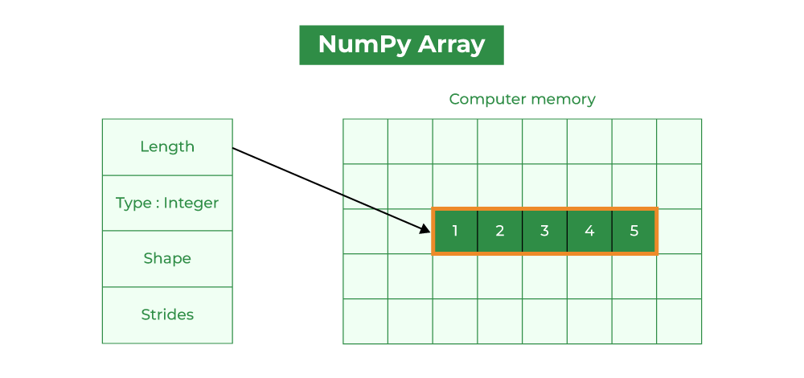

# Numpy Basics

### Table of Contents
- [Numpy Installation](#numpy-installation)
- [Numpy Vs Python's Built-in List Data Structure](#numpy-vs-pythons-list-data-structure)
- [Memory Consumption: ndarray vs List](#memory-consumption-ndarray-vs-list)
- [Time Comparison between Python Lists and Numpy Arrays](#time-comparison-between-python-lists-and-numpy-arrays)
- [Numpy's Array Creating Functions](#numpy-array-creating-functions)
- [Different Standard NumPy Data Types](#different-standard-numpy-data-types)


## Numpy installation
**Installing pip**
```bash
$ sudo apt upgrade
$ sudo apt-get install python3-pip
```
**Creating Virtual environment**
```bash
$ sudo pip3 install virtualenv
$ virtualenv venv_name
$ source venv_name/bin/activate
```

**Creating kernel for notebook**
```bash
$ ipython kernel install --user --name=venv
```

**installing numpy**
```bash
$ pip install numpy
```

## Numpy Vs Python's List data structure
**Python List**
It is a mutable and can contain different data types variables.

```python
my_list = [ 1 , 2 , 3 , 4 ]
my_list
```
> [1, 2, 3, 4]

**Characteristics of List**
* Can be `homogenous` or `heterogeneous`( regarding data types of the stored variables)
* Mutable and ordered.
* Looping required for element wise operation
* The elements are not stored in `contagious memory` (results in slower operation)
* Stores value along with its data type for each element (More size)

**Numpy array**
**Importing and using Numpy**
```python
import numpy as np
my_array = np.array([1,2,3,4,5])
my_array
```
> array([1, 2, 3, 4, 5])

**Chracteristics of Numpy array**

1. **Creation**: NumPy arrays can be created using `numpy.array()`. 
2. **Homogeneous Data**: By default, NumPy arrays are homogeneous (default data type is `float64`).This ensures efficient storage and computation.
3. **Element-wise Operations**: NumPy arrays support `element-wise operations`, allowing for efficient computation across arrays of the same shape.

4. **Functions, Methods, and Variables**: NumPy provides a rich set of functions, methods, and variables for array manipulation and computation. These include functions for mathematical operations, statistical analysis, and array manipulation methods.

5. **Contiguous Memory Storage**: Elements of a NumPy array are stored contiguously in memory.  

6. **Dimensional Consistency**: For multi-dimensional arrays, such as 2D or 3D arrays, all dimensions must be consistent.  

```python
single_array = np.array([1,2,3]) 
multi_array = np.array([(1, 2, 3), (4, 5, 6)])
print("single dim array : ", single_array)
print("multi dim array  : \n", multi_array)
```
```
single dim array :  [1 2 3]
multi dim array  : 
 [[1 2 3]
 [4 5 6]]
```

## Memory Consumption: ndarray vs List

Lists store additional information of each element such as its `type` and `reference count`. Since numpy store elements of only same data they are compact and memory efficient. Lists doesn't store memory in contagious memory locations thus causing memory fragmentation and inefficiency. 




Lets write a python program to find the size differnece between numpy array and lists.

 ```python 
import numpy as np 
import sys 
my_list = range(10000) 
print("Size of each element of list in bytes: ",sys.getsizeof(my_list))  
print("Size of the whole list in bytes: ",sys.getsizeof(my_list)*len(my_list))  
my_array = np.arange(10000) 
print("Size of each element of the Numpy array in bytes: ",my_array.itemsize) 
print("Size of the whole Numpy array in bytes: ",my_array.size*my_array.itemsize)
 ```
> Size of each element of list in bytes:  48
Size of the whole list in bytes:  480000
Size of each element of the Numpy array in bytes:  8
Size of the whole Numpy array in bytes:  80000

## Time Comparison between Python Lists and Numpy Arrays

A big part of NumPy's speed comes from using machine-native datatypes, instead of Python's object types.NumPy arrays are optimized for numerical computations, with efficient element-wise operations and mathematical functions. These operations are implemented in C, resulting in faster performance than equivalent operations on lists.
Lists are not optimized for numerical computations and may have slower mathematical operations due to Python’s interpretation overhead. They are generally used as general-purpose data structures.

Lets write a python program to find the time differnece between numpy array and lists.

```python 
import numpy as np
import time

# size of arrays and lists
size = 1000000

# declaring lists
my_list = range(0,size) 

# declaring arrays
my_array = np.arange(size) 
initialTime = time.time() #Set initial time

# Squaring each elements and storing in another list
squaredList = [a*a for a in my_list]

# calculating execution time
print("Time taken for squaring :",
	(time.time() - initialTime),
	"seconds")

# capturing time before the multiplication of Numpy arrays
initialTime = time.time()

# multiplying elements of both the Numpy arrays and stored in another Numpy array
resultantArray = np.square(my_array)

# calculating execution time
print("Time taken by NumPy for element wise squaring:",
	(time.time() - initialTime),
	"seconds")
```
> Time taken for squaring : 0.10040688514709473 seconds
Time taken by NumPy for element wise squaring: 0.0011780261993408203 seconds


## Numpy's Array Creating Functions

The central data structure of the Numpy library is array.They are all of the same type and referred to as the array dtype. The rank of the array is the no of dimensions.The shape of the array is a tuple of integers giving the size of the array along each dimension.


**Attributes of an array**  
`arr.ndim `: returns the dimension(axes) of the array
`arr.size` : retruns the total no of elements in the array
`arr.shape `: returns the shape of array
`

**Array initialization from list**

```
my_list = [[1,2,3],[4,5,6],[7,8,9]]
arr = np.array(my_list)
print("Array Shape : ", arr.shape )
print("Array Size : ", arr.size )
print("Array dimension : ", arr.ndim )
```
> Array Shape :  (3, 3)
Array Size :  9
Array dimension :  2

**np.zeroes**

Creates an array filled with 0s.
```python
np.zeros((2,4))
```
```
array([[0., 0., 0., 0.],
      [0., 0., 0., 0.]])
```

**np.ones**

Creates an array filled with 1s.
```python
np.ones((2,4))
```
``` 
array([[1., 1., 1., 1.],   
[1., 1., 1., 1.]])
```

**np.empty**

Creates an array filled with random number. The `advantage` of this function is faster initialization but later the value must be changed.
```python
np.empty(5)
```
> array([4.9e-324, 9.9e-324, 1.5e-323, 2.0e-323, 2.5e-323])

**np.arrange**

creates an array with range of elements. it is generally not possible to predict the number of elements obtained, due to the finite floating point precision
```python
np.arange(1,100,2)
```
 
> array([ 1,  3,  5,  7,  9, 11, 13, 15, 17, 19, 21, 23, 25, 27, 29, 31, 33,
       35, 37, 39, 41, 43, 45, 47, 49, 51, 53, 55, 57, 59, 61, 63, 65, 67,
       69, 71, 73, 75, 77, 79, 81, 83, 85, 87, 89, 91, 93, 95, 97, 99])


**np.linspace()**

Creates an array with values spaced linearly in a specified interval.
```python
np.linspace(start , end , num = number_of_element)
```
> array([ 1,  3,  5,  7,  9, 11, 13, 15, 17, 19, 21, 23, 25, 27, 29, 31, 33,
       35, 37, 39, 41, 43, 45, 47, 49, 51, 53, 55, 57, 59, 61, 63, 65, 67,
       69, 71, 73, 75, 77, 79, 81, 83, 85, 87, 89, 91, 93, 95, 97, 99])


If we dont specify the datatype in the array creation then the default datatype will be `float64`. To specify the datatype.

```python
np.ones(4, dtype = np.int64)
```

**array creation from other arrays**

By different operation between array we can create a new array
```python
a = np.array([20, 30, 40, 50])
b = np.arange(4)
c = a - b 
c
```
> array([20, 29, 38, 47])


**From slicing**

```python
a_1 = np.array([1,2,3,4,5,6,7])
b1 = a_1[:4]
b1
```
> array([1, 2, 3, 4])

**Shallow vs Deep Copy**

A shallow copy creates a new array, but it does not create new copies of the elements within the array. Instead, it points to the same elements as the original array. A deep copy, on the other hand, creates a completely independent copy of both the array and its data. It does not share any data with the original array

```python
# Shallow copy
arr1 = np.ones(10)
arr2 = arr1
arr2[3] = 0
print(arr1)
print(arr2)
```
> [1. 1. 1. 0. 1. 1. 1. 1. 1. 1.]
[1. 1. 1. 0. 1. 1. 1. 1. 1. 1.]


```python
# Deep copy
arr1 = np.ones(10)
arr2 = arr1.copy()
arr2[3] = 0
print(arr1)
print(arr2)
```
> [1. 1. 1. 1. 1. 1. 1. 1. 1. 1.]
[1. 1. 1. 0. 1. 1. 1. 1. 1. 1.]

## Different Standard NumPy Data Types
This is the list for numpy datatypes

Here's a markdown table representing the data types you provided:


| Data Type | Description                                   |
|-----------|-----------------------------------------------|
| bool_     | Boolean                                       |
| int_      | Default integer type (int64 or int32)         |
| intc      | Identical to the integer in C (int32 or int64)|
| intp      | Integer value used for indexing               |
| int8      | 8-bit integer value (-128 to 127)            |
| int16     | 16-bit integer value (-32768 to 32767)       |
| int32     | 32-bit integer value  |
| int64     | 64-bit integer value  |
| uint8     | Unsigned 8-bit integer value (0 to 255)      |
| uint16    | Unsigned 16-bit integer value (0 to 65535)   |
| uint32    | Unsigned 32-bit integer value  |
| uint64    | Unsigned 64-bit integer value  |
| float_    | Float values                                  |
| float16   | Half precision float values                   |
| float32   | Single-precision float values                 |
| float64   | Double-precision float values                 |
| complex_  | Complex values                                |
| complex64 | Represent two 32-bit float complex values (real and imaginary)|
| complex128| Represent two 64-bit float complex values (real and imaginary)|


Below is also a list of all data types in NumPy and the characters used to represent them.

    i - integer
    b - boolean
    u - unsigned integer
    f - float
    c - complex float
    m - timedelta
    M - datetime
    O - object
    S - string
    U - unicode string
    V - fixed chunk of memory for other type ( void )

**Finding datatype**
```python
print(arr.dtype)
```

```python
arr = np.array([1, 2, 3, 4], dtype='i4')
arr.dtype
```
> dtype('int32')

`i4` can be analyzed as i represents integer and 4 represents the bytes.

If a type is given in which elements can't be casted then NumPy will raise a ValueError.
> ValueError: In Python ValueError is raised when the type of passed argument to a function is unexpected/incorrect.


Converting Data Type on Existing Arrays
```python
new_arr = old_arr.astype('some d type')
```
```python
array_int = np.array([1,2,3,4,5],dtype= np.float64)
print("Before type conversion : ",array_int.dtype)
new_array = array_int.astype(np.uint16)
print("After type conversion : ",new_array.dtype)

```
> Before type conversion :  float64
After type conversion :  uint16

**check if  a array is of a datatype**
```python
>>> d = np.dtype(int)
>>> np.issubdtype(d, np.integer)
True

>>>np.issubdtype(d, np.floating)
False
```

**Overflow error**
The python integer automatically increases its byte size and doesn't overflow but numpy array can overflow.

Example :

```python

>>> np.power(100, 8, dtype=np.int64)
10000000000000000

>>> np.power(100, 8, dtype=np.int32)
1874919424
```

## References

https://www.geeksforgeeks.org/python-lists-vs-numpy-arrays/

https://numpy.org/doc/1.26/user/absolute_beginners.html

https://numpy.org/doc/1.26/reference/arrays.dtypes.html#arrays-dtypes

https://www.w3schools.com/python/numpy/numpy_data_types.asp
