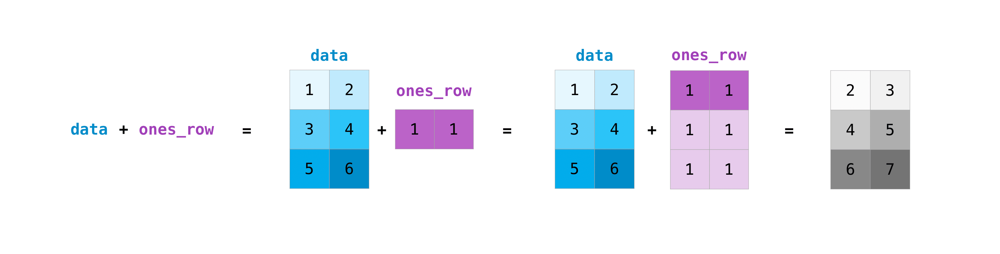

# Array Manipulation in NumPy

1. [Indexing & Slicing](#indexing--slicing)
    - [Sorting](#sorting)
    - [One-dimensional Indexing](#one-dimensional-indexing)
    - [Multidimensional Indexing](#multidimensional-indexing)
2. [Flatten](#flatten)
    - [Flatten](#flatten-1)
    - [Ravel](#ravel)
3. [Reshape](#reshape)
    - [Flipping](#flipping)
    - [Adding Dimensions](#adding-dimensions)
4. [Join](#join)
    - [Concatenate](#i-concatenate)
    - [Stack](#ii-stack)
        - [Horizontal Stack](#horizontal-stack)
        - [Vertical Stack](#vertical-stack)
        - [Height Stack](#height-stack)
5. [Split](#split)
6. [Broadcasting](#broadcasting)
7. [References](#references)


## Indexing & Slicing


### Sorting

```python
arr = np.array([3,10,2,3,4,5,6])
np.sort(arr)
```
```
array([ 2,  3,  3,  4,  5,  6, 10])
```

### Condition selecting

**Selecting that fullfill certain condition**

```python
array = np.arange(20)
print(array[array%2 == 0])
```
```
[ 0  2  4  6  8 10 12 14 16 18]
```

**Combining Two Conditions**

```python
print(array[ (array > 10) & (array < 25) ])
```
```
[11 12 13 14 15 16 17 18 19]
```

**np.nonzero**

```python
arr = np.array([[1,2,3],
    [4,5,6],
    [7,8,9]        
])
b = np.nonzero(arr < 5)
b

```
```
(array([0, 0, 0, 1]), array([0, 1, 2, 0]))
```
Explanation : the value at [0][0] , [0][1] , [0][2] , [1][0] are less than 5. So it returns the coordinates of the element that fulfills the condition.

### One-dimensional Indexing

One-dimensional indexing in NumPy allows accessing elements along a single axis of an array.

Example:
```python
import numpy as np

arr = np.array([1, 2, 3, 4, 5])

# Accessing the second element
element = arr[1]
print(element)  # Output: 2

# Slicing to get a sub-array
sub_arr = arr[2:4]
print(sub_arr)  # Output: [3 4]
```

### Multidimensional Indexing

Multidimensional indexing enables accessing elements from arrays with multiple axes.

Example:
```python
import numpy as np

arr = np.array([[1, 2, 3], [4, 5, 6]])

# Accessing the element in the second row, third column
element = arr[1, 2]
print(element)  # Output: 6

# Slicing to get a sub-array
sub_arr = arr[:, 1:]
print(sub_arr)
```
Output:
```
[[2 3]
 [5 6]]
```

## Flatten

Flattening an array means converting a multidimensional array into a one-dimensional array. NumPy provides two methods for flattening arrays: `flatten` and `ravel`.

### Flatten

The `flatten` method creates a new one-dimensional array by copying the elements of the input array.

Example:
```python
import numpy as np

arr = np.array([[1, 2, 3], [4, 5, 6]])

# Flattening the array
flattened_arr = arr.flatten()
print(flattened_arr)  # Output: [1 2 3 4 5 6]
```

### Ravel

The `ravel` method also flattens the array, but it returns a flattened view of the original array whenever possible.

Example:
```python
import numpy as np

arr = np.array([[1, 2, 3], [4, 5, 6]])

# Raveling the array
raveled_arr = arr.ravel()
print(raveled_arr)  # Output: [1 2 3 4 5 6]
```

> Differences between flatten and ravel is that , the variable that stores the `.ravel()` output is linked to the original variable. Any changes we make to the new variable will have corresponding changes in the original array. While the new and old variable are seperate in `flatten` .


## Reshape

Reshaping an array means changing the shape (dimensions) of the array without changing its data.

Example:
```python
import numpy as np

arr = np.array([1, 2, 3, 4, 5, 6])

# Reshaping the array to a 2x3 matrix
reshaped_arr = arr.reshape(2, 3)
print(reshaped_arr)
```
Output:
```
[[1 2 3]
 [4 5 6]]
```

### Flipping
```python
data = np.array([ [1,2,3,4,5,6],[6,7,8,9,10,11]])
np.flip(data)
```
```
array([[11, 10,  9,  8,  7,  6],
       [ 6,  5,  4,  3,  2,  1]])
```

### Adding Dimensions

```python
a = np.array([1,2,3,4,5,6])
print(a.shape)
b = a[np.newaxis, :]
print(b)
print(b.shape)
```
```
(6,)
[[1 2 3 4 5 6]]
(1, 6)

```
```python
b = a[: , np.newaxis]
print(b)
print(b.shape)
```
```
[[1]
 [2]
 [3]
 [4]
 [5]
 [6]]
(6, 1)
```
```python
# We can also use no.expand_dims
c = np.expand_dims(a , axis = 1)
print(c)
print(c.shape)
```
```
[[1]
 [2]
 [3]
 [4]
 [5]
 [6]]
(6, 1)
```
```python
c = np.expand_dims(a , axis = 0)
print(c)
print(c.shape)
```
```
[[1 2 3 4 5 6]]
(1, 6)
```

## Join

### i. Concatenate

The `concatenate` function in NumPy is used to join arrays along an existing axis.

Example 1:
```python
arr_1 = np.array([1,2,3,4,5])
arr_2 = np.array([6,7,8,9,10])
arr_3 = np.concatenate((arr_1, arr_2))
arr_3
```
```
array([ 1,  2,  3,  4,  5,  6,  7,  8,  9, 10])
```


Example 2:
```python
import numpy as np

arr1 = np.array([[1, 2], [3, 4]])
arr2 = np.array([[5, 6]])

# Concatenating along axis 0 (vertical concatenation)
result = np.concatenate((arr1, arr2), axis=0)
print(result)
```
Output:
```
[[1 2]
 [3 4]
 [5 6]]
```

### ii. Stack

Stacking refers to joining a sequence of arrays along a new axis.

#### Horizontal Stack

The `hstack` function stacks arrays in sequence horizontally (column-wise).

Example:
```python
import numpy as np

arr1 = np.array([1, 2, 3])
arr2 = np.array([4, 5, 6])

# Horizontal stacking
result = np.hstack((arr1, arr2))
print(result)
```
Output:
```
[1 2 3 4 5 6]
```

#### Vertical Stack

The `vstack` function stacks arrays in sequence vertically (row-wise).

Example:
```python
import numpy as np

arr1 = np.array([[1, 2], [3, 4]])
arr2 = np.array([[5, 6], [7, 8]])

# Vertical stacking
result = np.vstack((arr1, arr2))
print(result)
```
Output:
```
[[1 2]
 [3 4]
 [5 6]
 [7 8]]
```

#### Height Stack

The `dstack` function stacks arrays in sequence depth-wise (along the third axis).

Example:
```python
import numpy as np

arr1 = np.array([[1, 2], [3, 4]])
arr2 = np.array([[5, 6], [7, 8]])

# Height stacking
result = np.dstack((arr1, arr2))
print(result)
```
Output:
```
[[[1 5]
  [2 6]]

 [[3 7]
  [4 8]]]
```

## Split

The `split` function splits an array into multiple sub-arrays along a specified axis.

Example 1:
```python
arr = np.arange(9)

# Splitting array into three equal parts
result = np.split(arr, 3)
print(result)
```
Output:
```
[array([0, 1, 2]), array([3, 4, 5]), array([6, 7, 8])]
```

Example 2:
```python
arr_1 = np.array([
        [1,2,3,4,5,6],
        [7,8,9,10,11,12]
])
arr_2 = np.hsplit(arr_1,3) # Thiis splits the array into 3 equal shaped
print(arr_2[0])
print(arr_2[1])
print(arr_2[2])
```
```
[[1 2]
 [7 8]]
[[ 3  4]
 [ 9 10]]
[[ 5  6]
 [11 12]]
```

## Broadcasting

Broadcasting is a powerful mechanism in NumPy that allows arrays of different shapes to be combined together. It is particularly useful when performing arithmetic operations on arrays.

An array can be considered broadcastable if it satisfies the following rules:

* The arrays have the same shapes
* The arrays have the same number of dimensions and the length of each dimension is either of common length or 1.
* If an array has a different number of dimensions then the array with fewer dimensions can have its shape prepended.


Example 1:
```python
import numpy as np

arr1 = np.array([[1, 2, 3], [4, 5, 6]])
arr2 = np.array([10, 20, 30])

# Broadcasting arr2 to arr1 shape
result = arr1 + arr2
print(result)
```
Output:
```
[[11 22 33]
 [14 25 36]]
```
Above concept can be understood through this image



Example 2 :
```python
# Broadcasting
arr_1 = np.array([
    [1,2,3],
    [4,5,6],
    [7,8,9]
])
print(arr_1.shape)
arr_2 = arr_1 + 1; # Here scalar 1 is broadcasted to match the shape of arr_1
print(arr_2)
```
**Concept Image**


## References
https://numpy.org/doc/1.26/user/absolute_beginners.html#adding-removing-and-sorting-elements

https://www.geeksforgeeks.org/numpy-array-broadcasting/