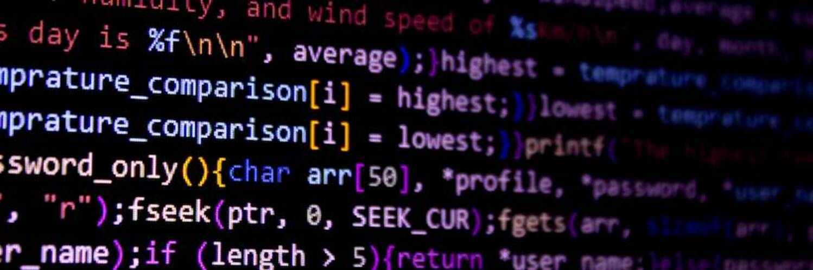
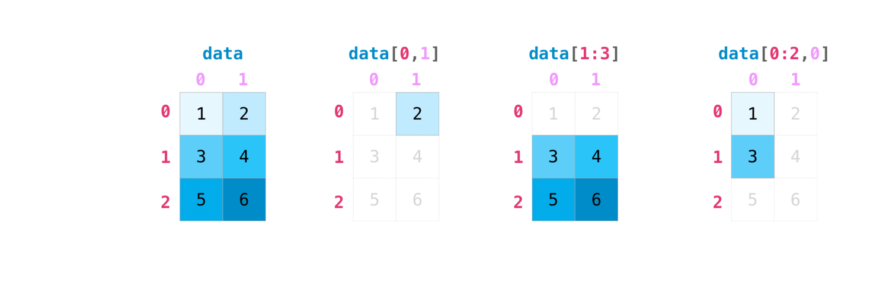
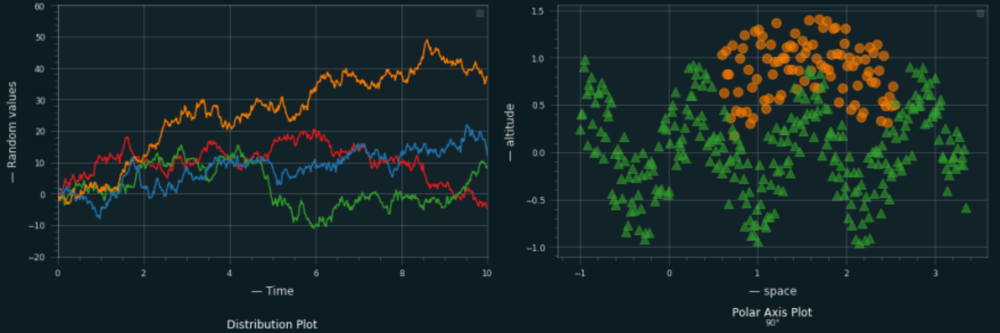

# Python Basic Packages Revisited
  

## Python Basics

---

## Numpy Understanding

---

## Array Manipulations

---

## Pandas Understanding

---

## Matplotlib Understanding

---

## FastAPI

 

 
