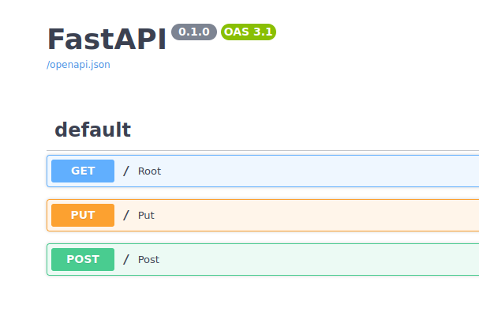
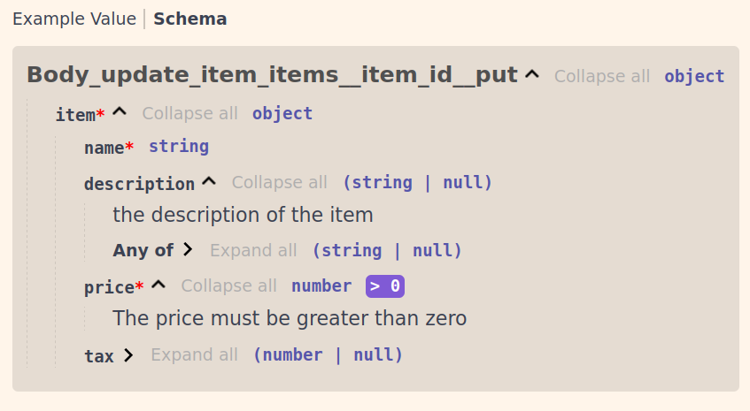
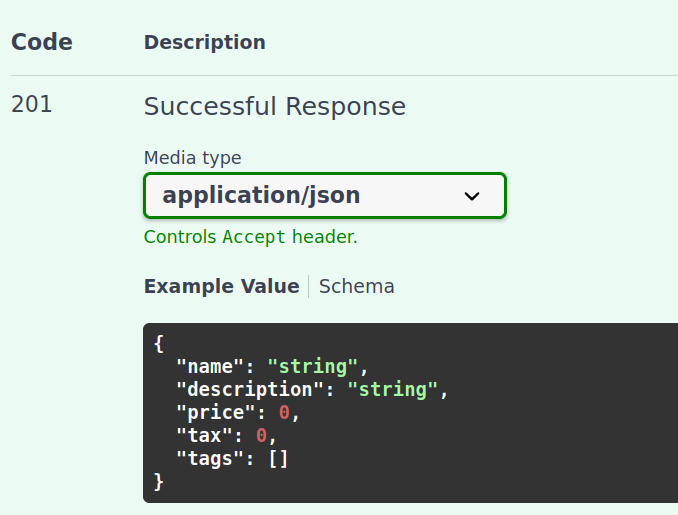
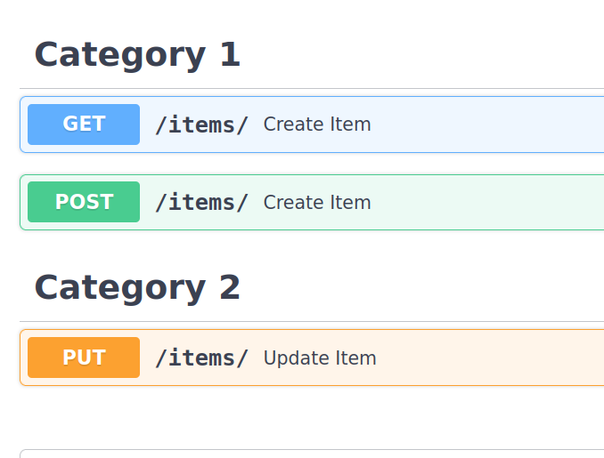
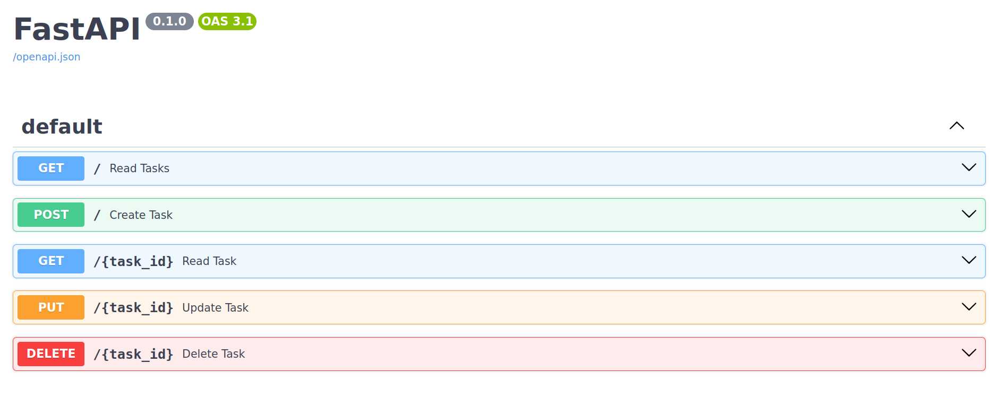

# FastAPI

## Table of Contents

  - [Installing FastApi](#installing-fastapi)
  - [Seeing the docs](#seeing-the-docs)
  - [Path Parameter](#path-parameter)
  - [Different route response](#different-route-response)
  - [Query Parameter](#query-parameter)
  - [Request Body](#request-body)
  - [Query Parameters and String Validation](#query-parameters-and-string-validation)
  - [Default Query](#default-query)
    - [String Validation](#string-validation)
  - [Setting alias](#setting-alias)
  - [Hiding Query](#hiding-query)
  - [Path Parameters and Numeric Validation](#path-parameters-and-numeric-validation)
  - [Sending Multiple Parameters](#sending-multiple-parameters)
  - [Body - field](#body---field)
  - [Body- Nested Models](#body--nested-models)
  - [Declare Request Example Data](#declare-request-example-data)
  - [Extra Datatypes](#extra-datatypes)
  - [Cookie and Header Parameters](#cookie-and-header-parameters)
  - [Response Model](#response-model)
  - [Response status Codes](#response-status-codes)
  - [Form Fields](#form-fields)
  - [Request Files](#request-files)
  - [Getting multiple files](#getting-multiple-files)
  - [Request forms and files](#request-forms-and-files)
  - [Handling Errors](#handling-errors)
  - [Custom Exception Class](#custom-exception-class)
  - [Path Operation Configuration](#path-operation-configuration)
    - [Tags](#tags)
  - [Bigger Applications - Multiple Files](#bigger-applications---multiple-files)
  - [APIRouter](#apirouter)
  - [Dependencies](#dependencies)

## [Task Planner Project ](#dependencies)


### Installing FastAPI
To install FastAPI install them using pip. 

```bash
$ pip install fastapi
$ pip install uvicorn[standard]
```

To setup our first app. We create a app in FastAPI then apply app.get decorator to our defined function

```python

from fastapi import FastAPI
app = FastAPI()

@app.get("/")
async def root():
    return {"message" : "hello world"}
```


Now to run our app we go to the bash command and hit the following command :

```bash
uvicorn main:app
```

and we get the following, 

```bash
ekbanaswodesh@nitroV:~/Documents/EKbana/swodeshsharma/fastApi$ uvicorn main:app 
INFO:     Started server process [48890]
INFO:     Waiting for application startup.
INFO:     Application startup complete.
INFO:     Uvicorn running on http://127.0.0.1:8000 (Press CTRL+C to quit)
```

we can see our app is running in `http://127.0.0.1:8000`.


When running this we have different flags which we can assign 

```bash
uvicorn main:app --port=8000 --reload
```
`--reload` flag will automatically look for all the changes in the code that we made and automatically update the page.


### Seeing the docs

if we go to the browser where out local server for the fastApi is running, and do following :

```
http://127.0.0.1:8000/docs
```
we get the swagger documentation.




### Path Parameter
lets take an example, here `123` is the path parameter

`localhost:8000/123`


```python
@app.get("/items")
async def list_items():
    return {"message" : "list items route"}
```

Now when we put the path parameter as `items`. We receive what we had returned above.

we can return the item id through this.

```python
@app.get("/items/{item_id}")
async def get_items(item_id):
    return {"item_id" : item_id}
```


if we go to the browser and put the path parameter as :

```
http://127.0.0.1:8000/items/10
```

we recieve 

{"item_id":"10"}

We can see the item_id is returned as string. To return it as int we can do this

```python
@app.get("/items/{item_id}")
async def get_items(item_id : int):
    return {"item_id" : item_id}
```

Then it returns

{"item_id": 10}


### Different route response

When we have two route such as this
```python
@app.get("/users/{user_id}")
async def get_users(user_id : str ):
    return {"user_id" : user_id}

@app.get("/users/me")
async def get_current_user():
    return {"message" : "This is the current user"}
```

and when we do Get request of :

```
localhost:8000/users/me
```

instead of returning the message `"This is the current user"` it gets the above route.

We can specify only certain types of data to be received during get request.

```python
from enum import Enum

class FoodEnum(str, Enum):
    fruits = "fruits"
    vegetables = "vegetables"
    dairy = "dairy"     # class variables

@app.get("/foods/{food_name}")
async def get_food(food_name : FoodEnum):
    if food_name == FoodEnum.vegetables:
        return {"food_name" : food_name, "message": "you are healthy"}
    
    if food_name.value == 'fruits':
        return  {
            "food_name" : food_name,
            "message" : " Wow you are eating fruits cool."
        }
    return {
        "food_name" : food_name ,
        "message" : "Nice food"
    }

```

### Query Parameter

These are the parameter that allows more dynamic searching from the frontend side.

```python
fake_item_db = [{"item_name" : "Foo"} , {"item_name" : "Bar"} , {"item_name" : "Baz"} ]
@app.get("/items")
async def list_tems(skip: int = 0, limit : int = 10):
    return fake_item_db[skip : skip + limit]
```

In above code we have created a fake data base. Now if we want to make a query then it can be done as this :

```python
http://localhost:8000/items?skip=0&limit=1
```

we get 

item_name : "Foo"

Query paramater are those which aren't specified like path parameter.

**Path and Query Parameter both**


```python
fake_item_db = [{"item_name" : "Foo"} , {"item_name" : "Bar"} , {"item_name" : "Baz"} ]


@app.get("/items")
async def list_tems(skip: int = 0, limit : int = 10):
    return fake_item_db[skip : skip + limit]


@app.get("/items/{item_id}")
async def get_item(item_id: str, q: str | None, short: bool = False):
    item = {"item_id" : item_id}
    if q :
        item.update({"q" : q})
    if not short:
        item.update(
            {
            "description" : "Lorem ipsum"
            }
        )
    return item
```

### Request Body

This is more associated with post request

```python
class Item(BaseModel):
    name:str
    description : str | None = None
    price : float
    tax : float

@app.post("/items")
async def create_item(item: Item):
    return item
```

Using PUT

```python
@app.put("/items/{item_id}")
async def create_item_with_put(item_id : int, item : Item, q : str | None = None    ):
    result = {"item_id" : item_id, **item.dict()}
    if q :
        result.update({"q" : q})
    return result
```

In the above we have path parameter as well as query parameter and have specific `Item`.

For example :

`item_id` is 2 , q is `hello` and 

Request body is as :
```
{ 
  "name": "string",  
  "description": "string",  
  "price": 0,  
  "tax": 0  
}
```

Then the response we get is :

```
{
  "item_id": 2,
  "name": "string",
  "description": "string",
  "price": 0,
  "tax": 0,
  "q": "hello"
}
```


### Query Parameters and String Validation

### Default Query
```python
async def read_items(q: str | None = Query('hello')):
```

#### String Validation

```python
@app.get("/items")
async def read_items(q: str | None = None):
    results = {"items" : [{ "item_id" : "Foo"} , {"item_id"   : "Bar"}  ]   }
    if q :
        results.update( {"q" : q})
    return results
```

in the above cdode if we want to validate our query object then it can be done using FastApi built in Query().

If we want to make sure our query string is of max character of 10 and min character of 3. It can be done as follows :  
we update the above code as 
```python
@app.get("/items")
async def read_items(q: str | None = Query(None,min_length= 3, max_length = 10)):
    results = {"items" : [{ "item_id" : "Foo"} , {"item_id"   : "Bar"}  ]   }
    if q :
        results.update( {"q" : q})
    return results
```

We can also declare whether the query parameter is required or not using `Query()` as well.

In the above when it is `None`, it is not compulsarily required. 

If we want to make sure it is required we can use `...` in place of `None`

**Passing multiple Query parameters**

```python
async def read_items(q: list[str] | None = Query(None)):
```

### Setting alias 

```python
async def read_items(q: list[str] | None = Query(None , alias = "item-query"  )):
```

### Hiding Query


```python
@app.get("/items_hidden/hidden")
async def hidden_query_route(hidden_query: str | None = Query(None, include_in_schema= False)    ):
    if hidden_query : 
        return {"hidden_query" : hidden_query}
    return {"hidden_query" : "Not found"}
```

if we look at the swagger docs, the parameter isn't shown. we have to specifically mention the parameter for Get request.

### Path Parameters and Numeric Validation

```python
@app.get("/items_validation/{item_id}")
async def read_items_validation(
    item_id : int = Path(..., title= " The ID of the item to get" , ge=10), 
    q:str | None = Query(None, alias= "item-query")
    ):
    results = {"item_id" : item_id}
    if q:
        results.update({"q" : q})
    return results
```

in above we have applied numeric validation to the path parameter. It must be greate or equal to 10

### Sending Multiple Parameters

```python
class Item(BaseModel):
    name : str
    description: str | None = None
    price : float
    tax : float | None = None

class User(BaseModel):
    username : str
    full_name : str | None = None

@app.put("/items/{item_ide}")
async def update_item(
    *,
    item_id: int = Path(..., title= " The ID of the item to get" , ge = 0 , le = 150),
    q: str | None = None,
    item : Item | None = None,
    user : User ,
    number : int
):

    results = {"item_id" : item_id}
    if q :
        results.update({"q" : q})
    if item :
        results.update({"item" : item})
    if user :
        results.update({"user" : user})
    if number :
        results.update({"number" : number})
    return results
    ```

In the above code, 
we have one path parameter and one query. Also we have two request objects : item and user. Which we pass through the request body. Now We also want the `number : int` to be the request body but the fast api considers it as `query parameter`. To solve this we have a `body parameter` similar to path and query parameter in FastApi.

```python
number : int = Body(...)
```

we can specify that this isn't query parameter with this `Body` parameter

Also if we want a singular request body and want it to be a key-value pair it can be done as this.

```python
item: Item = Body(... , embed = True)
```
Now the item must be provided as dictionary.

### Body - field

```python
class Item(BaseModel):
    name : str
    description: str | None = Field( 
        None , title = "the description of the item", max_length = 20
        )
    price : float = Field(..., gt = 0, description= " The price must be greate than zero")
    tax : float | None = None
                                    
                                    
@app.put("/items/{item_id}")
async def update_item(item_id : int, item : Item = Body(... , embed= True)):
    results = {"item_id" : item_id, "item" : item}
    return results

```

The benefit of the Field is in schema.



### Body- Nested Models

```python
class Item(BaseModel):
    name : str
    description : str | None = None
    price : float | None = None
    tax : float | None = None
    tags: list[str] = []
```

we can use set as well
```python
class Item(BaseModel):
    name : str
    description : str | None = None
    price : float | None = None
    tax : float | None = None
    tags: set[str] = set()
```

In above code we have only sent multiple values for a parameter and we haven't nested model together. It can be done as following:

```python
class Item2(BaseModel):
    discount_rate : int
    inflation_rate : int
    url : HttpUrl

class Item(BaseModel):
    name : str
    description : str | None = None
    price : float | None = None
    tax : float | None = None
    tags: set[str] = set()
    item2 : Item2 | None = None
```

Now our request body would have sample such as this :
```
{
  "name": "string",
  "description": "string",
  "price": 0,
  "tax": 0,
  "tags": [],
  "item2": {
    "discount_rate": 0,
    "inflation_rate": 0,
    "url": "https://example.com/"
  }
}
```

Thus we nested a model within a model

### Declare Request Example Data

```python
class Item(BaseModel):
    name : str
    description : str | None = None
    price : float
    tax : float | None = None

    class Config:
        json_schema_extra = {
            "example" : {
                "name" : "Foo",
                "description" : "A very nice item",
                "price" : 16.25,
                "tax" : 1.6

            }
        }
```

Addition of the json_schema_extra allows us to display the request body example of our choice.

Another proper way to do is using the `Field()` from pydantic

```python
class Item(BaseModel):
    name : str = Field(..., example = "Item name")
    description : str = Field(None, example = "description of the item")
    price : float = Field(..., example = "20.5")
    tax : float | None = Field(..., example = "1.5")
```

Or we can use `example` within the Body()

```python
@app.put("/items/{item_id}")
async def update_item(item_id : int, item : Item = Body(..., example= {
    "name" : "Item name",
    "description" : "Item description",
    "price" : 20,
    "tax" : 3

})):
    results = {"item_id" : item_id, "item" : item}
    return results
```

### Extra Datatypes

Besides normal str, int , float we can pass variety of other datatypes

```python
@app.put("/items/{item_id}")
async def read_items(
    item_id: UUID,
    start_date: datetime | None = Body(None),
    end_date: datetime | None = Body(None),
    repeat_at: time | None = Body(None),
    process_after: timedelta | None = Body(None),
):
    start_process = start_date + process_after
    duration = end_date - start_process
    return {
        "item_id": item_id,
        "start_date": start_date,
        "end_date": end_date,
        "repeat_at": repeat_at,
        "process_after": process_after,
        "start_process": start_process,
        "duration": duration,
    }
```

In the above code we have used UUID and datetime 

An example of the UUID path parameter and response body is shown below :

http://localhost:8000/items/550e8400-e29b-41d4-a716-446655440000

and the response body is :

```
{
  "item_id": "550e8400-e29b-41d4-a716-446655440000",
  "start_date": "2024-06-19T08:43:03.720000+00:00",
  "end_date": "2024-06-19T08:43:03.720000+00:00",
  "repeat_at": "08:43:03.720000+00:00",
  "process_after": 259200,
  "start_process": "2024-06-22T08:43:03.720000+00:00",
  "duration": -259200
}
```

### Cookie and Header Parameters

```python
@app.get("/items")
async def read_items(
    cookie_id: str | None = Cookie(None),
    accept_encoding: str | None = Header(None),
    sec_ch_ua: str | None = Header(None),
    user_agent: str | None = Header(None),
    x_token: list[str] | None = Header(None),
):
    return {
        "cookie_id": cookie_id,
        "Accept-Encoding": accept_encoding,
        "sec-ch-ua": sec_ch_ua,
        "User-Agent": user_agent,
        "X-Token values": x_token,
    }
```

In the above code we are doing several things :

* we are retrieving cookie named `cookie_id` from the cookies. If it is not found then it will be `None`
* And similarly we are retrieving various header from the request.

### Response Model

Without response model , the example of response or output schema would just be string.

```python
class Item(BaseModel):
    name: str
    description: str | None = None
    price: float
    tax: float = 10.5
    tags: list[str] = []

@app.post("/items/")
async def create_item(item: Item):
    return item

```

In the above code if we go to the fastapi swagger docs and see at the example response. then it would just be 
` "string" `  

To show proper schema of the output we do :
```python
@app.post("/items/", response_model=Item)
async def create_item(item: Item):
    return item
```

Sometimes there may be information which we dont want to display in the schema such as user password. Then it can be done as :

```python
class UserBase(BaseModel):
    username: str
    email: EmailStr
    full_name: str | None = None


class UserIn(UserBase):
    password: str


class UserOut(UserBase):
    pass

@app.post("/user/", response_model=UserOut)
async def create_user(user: UserIn):
    return user

```

In this case, the input schema is 

```
{
  "username": "string",
  "password": "string",
  "email": "user@example.com",
  "full_name": "string"
}
```

and the output schema is

```python
{
  "username": "string",
  "email": "user@example.com",
  "full_name": "string"
}
```

we can inlude and exclude what to put in scheme using 

`response_model_exclude` or `response_model_include`

```python
@app.get("/items/{item_id}/public", response_model=Item, response_model_exclude={"tax"})
```

### Response status Codes

Instead of memorizing the status code, we can easily return the status code using FastApi `status.HTTP_...`

```python
@app.post("/items/", status_code= status.HTTP_201_CREATED)
async def create_item(name: str):
    return {"name": name}


@app.delete("/items/{pk}", status_code= status.HTTP_204_NO_CONTENT)
async def delete_item(pk: str):
    print("pk", pk)
    return pk


@app.get("/items/", status_code= status.HTTP_302_FOUND)
async def read_items_redirect():
    return {"hello": "world"}

```

### Form Fields

It refers to the way we pass data to post request

This is our normal json format which we pass data to post.

```python
class User(BaseModel):
    username : str
    password : str

@app.post("/login-json/")
async def login_json(user : User):
    return user
```
Now, instead we can use Form from FastApi

```python
@app.post("/login/")
async def login(username : str = Form(...), password : str = Form(...)):
    print("password", password)
    return {"username" : username}

```

### Request Files
```python
@app.post("/files/")
async def create_file(file : bytes = File(...)):
    return{"file" : len(file)}

@app.post("/uploadfile/")
async def create_upload_file(file : UploadFile):
    return {"filename" : file.filename}
```

To wait while the content is being read we can do this 
```python
@app.post("/uploadfile/")
async def create_upload_file(file : UploadFile):
    contents = await file.read()
    return {"filename" : file.filename}
```

### Getting multiple files

```python
@app.post("/uploadfile/")
async def create_upload_file(
    files : list[UploadFile] = File(..., description= " multiple files")
    ):
    return {"filename" : [file.filename for file in files]}
```

### Request forms and files

```python
@app.post("/files/")
async def create_file(
    file: bytes = File(...),
    fileb: UploadFile = File(...),
    token: str = Form(...),
    hello: str = Body(...),
):
    return {
        "file_size": len(file),
        "token": token,
        "fileb_content_type": fileb.content_type,
        "hello": hello,
    }
```

### Handling Errors

One of the simplest method for error handling in FastApi is raising the `HTTPException`

```python
items = {
    "A" : "B",
    "C" : "D"
}

@app.get("/items/{item_id}")
async def read_item(item_id: str):
    if item_id not in items:
        raise HTTPException(status_code = status.HTTP_404_NOT_FOUND, detail = "Item not found")
```


### Custom Exception Class

```python
class exceptionClass(Exception):
    def __init__(self, name: str):
        self.name = name


@app.exception_handler(exceptionClass)
async def exceptionClass_handler(request: Request, exc: exceptionClass):
    return JSONResponse(
        status_code=418,
        content={"message": f"Oops! {exc.name} occured"},
    )

@app.get("/error_checker/{name}")
async def read_name(name : str):
    if name == "wrong" :
        raise exceptionClass(name = name)
    return {"name" : name}
```

In above code, whenever the `path parameter` is `wrong`.  A `exceptionClass` is instantiated and the it raises the exceptionClass which is caught by the exception handler and it returns the combined json response. 

### Path Operation Configuration

When we pass the path operator , we can define some operation to occur. For example lets say we are creating a user item. Now when the user id is created we want to show a status code for the response then it can be done as 

```python
@app.post("/items/", response_model=Item, status_code=status.HTTP_201_CREATED)
```


This makes the status code to be added to the schema as well.

#### Tags

we can add tags to the path operation as well with parameter `tags`.

Adding tags helps us in the documentation. when there are many endpoints it helps us to know which endpoints falls under which category.

```python
@app.post("/items/", response_model=Item, tags=["items"])
```

If there are large number of endpoints then, it is better to keep the tags inside Enum.

```python
class Tags(Enum):
    items = "items"
    users = "users"
```
And we can put the tags like this

```python
@app.get("/items/", tags=[Tags.items])
```
We can see by putting common tags to common path operation we can easily make the documentation better.


For better documentation purpose we can add `summary` and `description` as well.

```python
@app.post(
    "/items/",
    response_model=Item,
    summary="Create an item",
    description="Create an item with all the information, name, description, price, tax and a set of unique tags",
)
async def create_item(item: Item):
    return item
```


### Bigger Applications - Multiple Files

When we are doing a bigger project instead of putting all the code in one script files we make the code modular. 

To understand package and subpackage. The summary can be obtained from below diagram:

```
├── app                  # "app" is a Python package
│   ├── __init__.py      # this file makes "app" a "Python package"
│   ├── main.py          # "main" module, e.g. import app.main
│   ├── dependencies.py  # "dependencies" module, e.g. import app.dependencies
│   └── routers          # "routers" is a "Python subpackage"
│   │   ├── __init__.py  # makes "routers" a "Python subpackage"
│   │   ├── items.py     # "items" submodule, e.g. import app.routers.items
│   │   └── users.py     # "users" submodule, e.g. import app.routers.users
│   └── internal         # "internal" is a "Python subpackage"
│       ├── __init__.py  # makes "internal" a "Python subpackage"
│       └── admin.py     # "admin" submodule, e.g. import app.internal.admin
```
 
`__init__.py` is what allows us to import code from one file to another.

### APIRouter

API Router can be thought of as mini `FastAPI` class.

We can have many routers inside a web application. To import users and items router . Inside the `users.py` and `items.py` we should put following:

**routers/user.py**

```python
from fastapi import APIRouter
router = APIRouter()
@router.get("/users" , tags = ["users"])
# statements
```

### Dependencies

There can be some common functions or dependencies across several scripts. All the common dependencies are kept inside the `dependencies.py` which will be inside the main package.

## PROJECT

For the project i have made a simple task organizer. I have made the  script modular.

Here is the directory outlines :

```
my_app/
├── init.py
├── main.py
├── routers/
│ ├── init.py
│ ├── tasks.py
└── utils/
├── init.py
└── data.py
```
For storing the data, I have used the `json` file.

### Bash Command to run the server

```bash
uvicorn my_app.main:app --reload
```

### Swagger Docs



Using this we can test all the test points.

#### Adding a tasks

using `POST` and request body as given below we can add a task.
```
{
  "id": 1,
  "title": "Task-1",
  "description": "Complete the fastApi documentation",
  "completed": false
}
```

#### Updating a task
For updating the task we pass the `task_id` in `path` parameter aswell as a new request body. The data will then be updated in the json file as well.

using `PUT` and new updated request body we can update the task.
```
{
  "id": 1,
  "title": "Task-1",
  "description": "Complete the fastApi documentation",
  "completed": True
}
```

Similarly we can read all the task, or specific task or delete a specific task using the `item_id`.