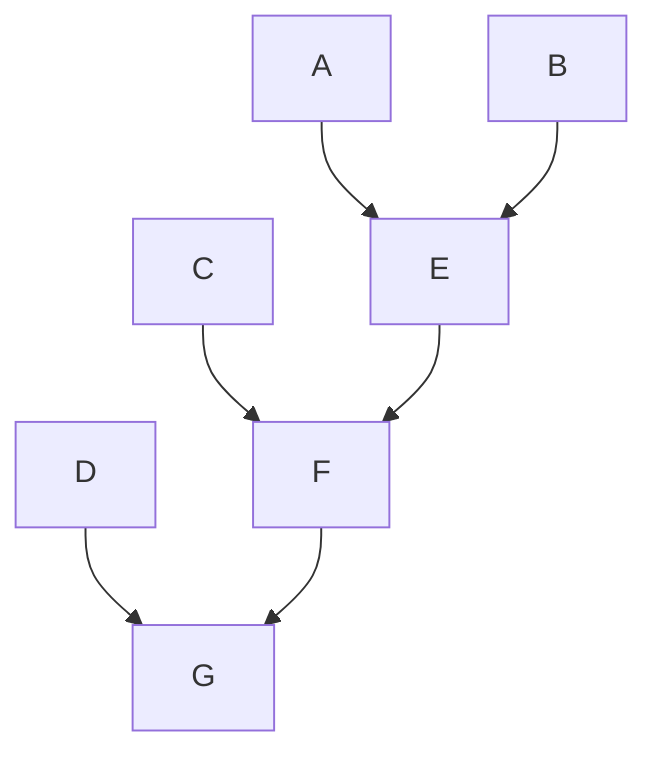

# Python Practice

## Table of Contents
 
- [Python Lists](#python-lists)
- [Built-in List Methods](#built-in-list-methods)
- [Tuple Builtin Methods](#tuple-builtin-methods)
- [Dictionary Methods](#dictionary-methods)
- [Functions](#functions)
  - [Arbitrary Arguments, *args](#arbitrary-arguments-args)
  - [Keyword arguments](#keyword-arguments)
  - [Arbitrary Keyword Arguments, **Kwargs](#arbitrary-keyword-arguments-kwargs)
  - [Positional-only Arguments](#positional-only-arguments)
  - [Keyword-Only Arguments](#keyword-only-arguments)
  - [Combining Positional-Only and Keyword-Only](#combining-positional-only-and-keyword-only)
- [Python Class](#python-class)
  - [Public vs Non-Public Members](#public-vs-non-public-members)
  - [Name Mangling](#name-mangling)
- [Advantages of using Classes](#advantages-of-using-classes)
  - [Class Attributes](#class-attributes)
  - [Instance Attributes](#instance-attributes)
  - [.__dict__ Attribute](#dict-attribute)
- [Dynamic Class and Instance Attributes](#dynamic-class-and-instance-attributes)
  - [Dunder Methods](#dunder-methods)
    - [1. `__init__` method](#1-__init__-method)
    - [2. `__repr__` method](#2-__repr__-method)
    - [3. `__add__` method](#3-__add__-method)
    - [4. `__call__` method](#4-__call__-method)
    - [Other various dunder methods](#other-various-dunder-methods)
  - [Object Instantiation and Destruction](#object-instantiation-and-destruction)
  - [Numeric Magic Methods](#numeric-magic-methods)
  - [Arithmetic Operators](#arithmetic-operators)
  - [String Magic Methods](#string-magic-methods)
  - [Comparison Magic Methods](#comparison-magic-methods)
  - [`__name__`](#name)
  - [Constructors](#constructors)
    - [Default Constructors](#default-constructors)
    - [Parameterized Constructors](#parameterized-constructors)
    - [Python Constructor Rules](#python-constructor-rules)
  - [Inheritance](#inheritance)
  - [super() function](#super-function)
  - [Operator Overloading](#operator-overloading)
    - [Overloading Unary Operators](#overloading-unary-operators)
    - [Overloading arithmetic operators](#overloading-arithmetic-operators)
    - [`@` operator](#-operator)
    - [Python Arithmetic operators](#python-arithmetic-operators)
  - [Docstrings](#docstrings)
    - [Numpydoc Style Docstrings](#numpydoc-style-docstrings)
- [Command line parsing in python](#command-line-parsing-in-python)
  - [Reading number from commandline](#reading-number-from-commandline)
  - [Reading list of strings](#reading-list-of-strings)
  - [Reading list of integers](#reading-list-of-integers)
  - [Passing Optional Arguments](#passing-optional-arguments)
  - [Passing one or more values using nargs=+](#passing-one-or-more-values-using-nargs)
- [Python Modules](#python-modules)
  - [Assigning Alias](#assigning-alias)
- [Python Virtual Environment](#python-virtual-environment)
  - [Pip list](#pip-list)
- [Python Exception Handling](#python-exception-handling)
  - [Try with Else Clause](#try-with-else-clause)
  - [Raising Exception](#raising-exception)
- [Reading and Parsing](#reading-and-parsing)
  - [File handling for JSON files](#file-handling-for-json-files) 
- [Lambda function](#lambda-function)
  - [Lambda function with iterables](#lambda-function-with-iterables)
- [map(), filter(), reduce()](#map-filter-reduce)
- [Decorators and Wrappers](#decorators-and-wrappers)
  - [First Class Citizens](#first-class-citizens)
  - [Decorators](#decorators)
  - [The functools.wraps()](#the-functoolswraps)
 

## Python Lists

Lists Characterstics

* Ordered
* Mutable
* Can be both homogeneous or heterogeneous
* Dynamic in size
* Indexable
* Iterable


List Creation


```python
my_list = ['a' , 'b' , 3 , True , False] # mixed list
empty_list = []
another_list = list([1,2,3,4,5]) # list using constructor
```

Indexing


```python
print(my_list[-2])
print(another_list[2:4])
```

    True
    [3, 4]


Adding New Elements


```python
# Using appen()
my_list.append(8)
empty_list.extend([9,8,7,6])
another_list.insert(2,10)
print(my_list)
print(empty_list)
print(another_list)
```

    ['a', 'b', 3, True, False, 8]
    [9, 8, 7, 6]
    [1, 2, 10, 3, 4, 5]


Removing Elements


```python
my_list.remove(8)
print(my_list)
```

    ['a', 'b', 3, True, False]


```python
my_list.pop() # removes and returns the last element
```


    False


```python
my_list.pop(1) # removes and returns the element at first index
```


    'b'


List Operations in Python


```python
# Joining Lists
l1 = [1,2,3,4,5]
l2 = [6,7,8,9,10]
l1+l2
```


    [1, 2, 3, 4, 5, 6, 7, 8, 9, 10]


```python
# Replicating lists
l1*2 # returns list repeated 2 times
```


    [1, 2, 3, 4, 5, 1, 2, 3, 4, 5]


```python
# List Reversing
l1[::-1]
```


    [5, 4, 3, 2, 1]


Deleting elements from a list


```python
del l1 # Deletes list l1
```


```python
temp_list = [1,1,2,2,4,5,6,7,7,7,8,8,9]
temp_list.index(8) # Returns the index of first occurence
```


    10


```python
temp_list.count(7) # Counts the items
```


    3


```python
l = [9,8,6,7,4,5,3,1,8,10]
l.sort()
l
```


    [1, 3, 4, 5, 6, 7, 8, 8, 9, 10]


```python
a = [1,2,3]
b = a.copy() # copies the list
```

## Built-in List Methods


```python
l = [9,8,6,7,4,5,3,1,8,10]
len(l)
max(l)
min(l)
sum(l)
sorted_list = sorted(l)
all(l)
any(l)
```


    True


enumerate()


```python
# Enumerate
# Helps Keep Count of the iterator
name_list = ['Ram', 'Shyam', 'Hari', 'Sita']
enumerator1 = enumerate(name_list) # Returns a tuple of data along with its iterator

print(list(enumerator1))
```

    [(0, 'Ram'), (1, 'Shyam'), (2, 'Hari'), (3, 'Sita')]


```python
for count,val in enumerate(name_list) :
    print("Count : ",count," Name : ",val)
```

    Count :  0  Name :  Ram
    Count :  1  Name :  Shyam
    Count :  2  Name :  Hari
    Count :  3  Name :  Sita


Using next() to access next element in a enumerator


```python
enumerator2 = enumerate(name_list)
print(next(enumerator2))
print(next(enumerator2))
print(next(enumerator2))
print(next(enumerator2))

```

    (0, 'Ram')
    (1, 'Shyam')
    (2, 'Hari')
    (3, 'Sita')


To check whether a variable is of certain datatypes or not we use 

isinstance(x, int)

**filter()**

Returns a new list containing only the items in a list for which a function returns True.


```python
def check(x):
    if isinstance(x, int):
        return True
    else :
        return False


mixed_list = [1,2,3,4,'a','b',8]
filtered_list = filter(check,mixed_list)
for i in filtered_list :
    print(i)

```

    1
    2
    3
    4
    8


**map()**

 map() returns a map object (an iterator)
 
 Instead of using a for loop, the map() function provides a way of applying a function to every item in an iterable


```python

old_list = [1,2,3,4,5,6,8]

def func(x):
    return x**2

new_list = map(func,old_list)
str(list(new_list))
```


    '[1, 4, 9, 16, 25, 36, 64]'


```python
# Using Built in funcitons
base_numbers = [2, 4, 6, 8, 10]
powers = [1, 2, 3, 4, 5]
numbers_powers = list(map(pow, base_numbers, powers))
print(numbers_powers)
```

    [2, 16, 216, 4096, 100000]


```python
# Using Lambda Function
new_list = map(lambda x: x**2,old_list)
print(list(new_list))
```

    [1, 4, 9, 16, 25, 36, 64]


zip()

Returns an iterator that combines multiple lists into tuples. 

The iterator stops when the shortest input iterable is exhausted.


```python
x = [1,2,3,4,5,6]
y = [9,8,7,6,5,4]
points = zip(x,y)
for point in points :
    print(point)
```

    (1, 9)
    (2, 8)
    (3, 7)
    (4, 6)
    (5, 5)
    (6, 4)


# Python Tuple

Tuple Characteristics

* Immutable
* Faster Access
* Sequence Operations( supports sequence operations such as indexing, slicing ..)
* Can store multiple datatypes


Use cases :

* Storing Fixed Data
* They can be used as dictionary keys
* Using tuple function can return multiple values


```python
# Tuple Creation

mixed_tuple = (1, 2, 3, 'a' , 'b')
print(mixed_tuple)

```

    (1, 2, 3, 'a', 'b')


```python
# Slicing
mixed_tuple[2:4]
```


    (3, 'a')


## Tuple Builtin Methods

They are similar to list built in methods

| Method/Function | Description                                                                                     |
|-----------------|-------------------------------------------------------------------------------------------------|
| count()         | Returns the number of occurrences of a specified element in a tuple.                           |
| index()         | Returns the index of the first occurrence of a specified element in a tuple.                   |
| len()           | Returns the number of elements in a tuple.                                                     |
| sorted()        | Returns a new tuple with the elements sorted in ascending order.                                |
| min()           | Returns the smallest element in a tuple.                                                       |
| max()           | Returns the largest element in a tuple.                                                        |
| tuple()         | Converts an iterable object into a tuple.                                                      |


```python
my_tuple = (1,2,3,4,5,9,8,7)
print(my_tuple.count(2))
print(my_tuple.index(5))
print(sorted(my_tuple))
print(max(my_tuple))
```

    1
    4
    [1, 2, 3, 4, 5, 7, 8, 9]
    9


Tuple Operation


```python
# Concatenating Tuples
tuple1 = (1, 2, 3)
tuple2 = ('a', 'b', 'c')  
print(tuple1 + tuple2)  
```

    (1, 2, 3, 'a', 'b', 'c')


```python
# Replicating Tuples
print(tuple1*3)
```

    (1, 2, 3, 1, 2, 3, 1, 2, 3)


```python
# Converting list to tuple
my_list = [1,2,3,4,5]
my_tuple = tuple(my_list)
print(my_tuple)
```

    (1, 2, 3, 4, 5)


**Updating tuples**

Since tuples are immutable we can't update them directly but we can update them by converting them into list , then modification and again back to tuple


```python
my_tuple = (1, 2, 3)

# Converting the tuple into a list

my_list = list(my_tuple)

# Updating the list

my_list[1] = 4

# Converting the list back into a tuple

updated_tuple = tuple(my_list)

print(updated_tuple)  # Output: (1, 4, 3)
```

    (1, 4, 3)


```python
# deleting tuple
del my_tuple
```

# Python Dictionary

A dictionary is a collection which is ordered*, changeable and do not allow duplicates.


```python
my_dict = {
    'a' : 1 ,
    'b' : 2 ,
    'c' : 3
}

print(my_dict)
```

    {'a': 1, 'b': 2, 'c': 3}


```python
my_dict['c']
```


    3


```python
# Duplicates Can't Exist in dictionary

my_dict = {
    'a' : 1 ,
    'b' : 2 ,
    'c' : 3 ,
    'c' : 8
}

print(my_dict)
# we can see the duplicate over writes the previous value
```

    {'a': 1, 'b': 2, 'c': 8}


```python
# Creating dictionary with constructor

my_dict = dict(name = 'Swodesh' , age = 22 , city = 'Kathmandu')
print(my_dict)
```

    {'name': 'Swodesh', 'age': 22, 'city': 'Kathmandu'}


```python
# Getting all the keys of the dictionary
# Here the keys_list is a view of the dictionary my_dict. So any changes done in the dictionary
# Keys will also be reflected in the key_list
keys_list = my_dict.keys()
keys_list
```


    dict_keys(['name', 'age', 'city'])


```python
my_dict["Company"] = "Ekbana"
```


```python
keys_list
```


    dict_keys(['name', 'age', 'city', 'Company'])


```python
# Getting Values
# Similar to above val_list is also a view of the my_dict values
val_list = my_dict.values()
val_list
```


    dict_values(['Swodesh', 22, 'Kathmandu', 'Ekbana'])


```python
# Getting Items
my_dict.items()
```


    dict_items([('name', 'Swodesh'), ('age', 22), ('city', 'Kathmandu'), ('Company', 'Ekbana')])


```python
# Checking if key exists
if 'age' in my_dict :
    print("Yes there is info regarding age")
```

    Yes there is info regarding age


Updating Dictionary


```python
my_dict.update({'city' : 'lalitpur'})
my_dict
```


    {'name': 'Swodesh', 'age': 22, 'city': 'lalitpur', 'Company': 'Ekbana'}


Removing items


```python
my_dict.pop('Company')
```


    'Ekbana'


```python
my_dict
```


    {'name': 'Swodesh', 'age': 22, 'city': 'lalitpur'}


Clearing and Deleting dictionary

Clear method clears the whole dictionary 

Delete methods deletes the whole dictionary


```python
my_dict.clear()
my_dict
```


    {}


```python
del my_dict
```

Creating dictionary Copy


```python
my_dict = dict(name = 'Swodesh' , age = 22 , city = 'Kathmandu')

another_dict = my_dict.copy()
another_dict2 = dict(my_dict)
```

**Nested Dictionary**

**A dictionary inside a dictionary**


```python
my_dictionary ={
    "my_dict1" : {
        "name" : "Ram" ,
        "Age" : 19
    },

     "my_dict2" : {
        "name" : "Shyam" ,
        'age' : 19
    },

     "my_dict3" : {
        "name" : "Hari" ,
        'age' : 19
    }

}

my_dictionary['my_dict1']["name"]
```


    'Ram'


## Dictionary Methods

| Method      | Description                                                   |
|-------------|---------------------------------------------------------------|
| clear()     | Removes all the elements from the dictionary                  |
| copy()      | Returns a copy of the dictionary                              |
| fromkeys()  | Returns a dictionary with the specified keys and value        |
| get()       | Returns the value of the specified key                        |
| items()     | Returns a list containing a tuple for each key value pair     |
| keys()      | Returns a list containing the dictionary's keys               |
| pop()       | Removes the element with the specified key                   |
| popitem()   | Removes the last inserted key-value pair                      |
| setdefault()| Returns the value of the specified key. If the key does not exist: insert the key, with the specified value |
| update()    | Updates the dictionary with the specified key-value pairs     |
| values()    | Returns a list of all the values in the dictionary            |


**fromkeys()**


```python
x = ('key1', 'key2', 'key3')
y = 0

thisdict = dict.fromkeys(x, y)

print(thisdict)
```

    {'key1': 0, 'key2': 0, 'key3': 0}


# Python Sets

It is a built in data structure used to store a collection of unique items.

**Characteristics**

* Unordered
* Unindexed
* Mutable
* Iterable

**Applications**

* Removing Duplicates
* Performing mathematical set operations like integers, floats, tuples or strings

**Creating Python Set**

From List , Tuple 


```python
my_set_1 = set([1,2,3,4,5])
my_set_2 = set((1,2,3,4,5))
print(my_set_1)
print(my_set_2)
```

    {1, 2, 3, 4, 5}
    {1, 2, 3, 4, 5}


**Checking Set Membership**


```python
print(3 in my_set_1)
```

    True


**Set Built in Methods**

| Method            | Description                                                      |
|-------------------|------------------------------------------------------------------|
| `add()`           | Adds an element to the set.                                      |
| `clear()`         | Removes all elements from the set.                               |
| `copy()`          | Returns a shallow copy of the set.                                |
| `difference()`    | Returns the difference of two or more sets as a new set.         |
| `difference_update()` | Removes all elements of another set from this set.              |
| `discard()`       | Removes an element from the set if it is a member.               |
| `intersection()`  | Returns the intersection of two or more sets as a new set.       |
| `intersection_update()` | Updates the set with the intersection of itself and another set.|
| `isdisjoint()`    | Returns True if two sets have a null intersection.               |
| `issubset()`      | Returns True if another set contains this set.                   |
| `issuperset()`    | Returns True if this set contains another set.                   |
| `pop()`           | Removes and returns an arbitrary element from the set.           |
| `remove()`        | Removes an element from the set.                                 |
| `symmetric_difference()` | Returns the symmetric difference of two sets as a new set.   |
| `symmetric_difference_update()` | Updates the set with the symmetric difference of itself with another set. |
| `union()`         | Returns the union of sets as a new set.                          |
| `update()`        | Updates the set with the union of itself and others.             |
| `all() `        |  Returns True if all items of the set evaluate to True, or if the set is empty       |
| `any() `        | Returns True if at least one item of the set evaluates to True (for an empty set, returns False)             |

**Performing Mathematical Sets**


```python
a = {1, 2, 3, 4, 5}
b = {4, 5, 6, 7}
print(a.union(b))
print(a.intersection(b))
print(a.difference(b))

```

    {1, 2, 3, 4, 5, 6, 7}
    {4, 5}
    {1, 2, 3}


# Python Functions and Classes

## Functions

`Arguments` also called `args` are the parameters passed to a function  

From a function's perspective:

A parameter is the variable listed inside the parentheses in the function definition.

An argument is the value that is sent to the function when it is called.


**Argument Types**

* Default Arguments
* Keyword Arguments
* Positional Arguments
* Arbitrary Positional Arguments
* Arbitrary Keyword Arguments

### Arbitrary Arguments, *args

In case we dont know how many arguments to pass into a function we add `*` before the parameter. This makes the function receive a tuple of arguments


```python
def func(*names):
    for name in names:
        print(name)

func('Ram','Shyam','Haru')
```

    Ram
    Shyam
    Haru


### Keyword arguments 
The parameter can be passed into  a `key`and can be send in un ordered fashion


```python
def my_function(child3, child2, child1):
  print(" The oldest person in " + child1)

my_function(child1 = "Ram", child2 = "Hari", child3 = "Shyam")
```

     The oldest person in Ram


### Arbitrary Keyword Arguments, **Kwargs

In case we want to pass vairable keyword arguments, we use two asterik `**`

In this case the argument provides dictionary into the function and the key will be the keyword used by the user when passing names into the function

We can have only one `**Kwargs` 


```python
def my_function(**names):
    print(names)

my_function(first_person = "Ram", second_person = "Hari") 
```

    {'first_person': 'Ram', 'second_person': 'Hari'}


### Positional-only Arguments

To specify that a function can have ONLY positional arguments or ONLY keywords arguments we add, `/` after the arguments.

Without `/` we can send both positional or keyword arguments.


```python
def my_function(x, /):
  print(x)

my_function(3) 
```

    3


``` python
def my_function(x, /):
  print(x)

my_function(3)
```

TypeError : Traceback (most recent call last)
Cell In[9], line 1
----> 1 my_function( x = 3)

TypeError: my_function() got some positional-only arguments passed as keyword arguments: 'x'


### Keyword-Only Arguments


To specify only keyword arguments are allowed we add `*,` before the arguments


```python
def my_function(*, x):
  print(x)

my_function(x = 3) 
```

    3


```python
def my_function(x):
  print(x)

my_function(3) 
```
TypeError: my_function() takes 0 positional arguments but 1 was given


### Combining Positional-Only and Keyword-Only


```python
def my_function(a,b,/,*,c,d):
    print(a+b+c+d)

my_function(1,2,c=3,d=4)
```

    10


## Python Class

`Class` : Template for a object  
`Object` : Instance of a class  
`Attributes` : Properties or data associated with a object of a class  
`Methods` : Functions that we define withing a class

**Defining Class**


```python
class person :
    def __init__(self,name,age):
        self.name = name
        self.age = age

    def say_name(self):
        print("Hello my name is ", self.name)
    
```

`__init__()` this is a initializer. It defines and sets the initial values the class attributes.  
It is also called constructor

**Creating Objects From Class**


```python
ram = person('Ram',18)
```

**Accessing attributed and methods**


```python
ram.say_name()
print(ram.age)
```

    Hello my name is  Ram
    18


### Public vs Non-Public Members

n Python, all attributes are accessible in one way or another. Thus,we have to use a naming convention to tell that our attribute or method is public or not  
The naming convention consists of adding a leading underscore to the member’s name

| Member      | Naming                            | Examples            |
|-------------|-----------------------------------|---------------------|
| Public      | Use the normal naming pattern.    | age, say_name() |
| Non-public  | Include a leading underscore in names. | _age, _say_name() |


Though we can access the non public attributes its a bad practice

### Name Mangling

Adding two underscores represents name mangling.
It results in hiding the attribute. Thus, they aren't available for direct access.


```python
class person :
    def __init__(self,name,age):
        self.__name = name
        self.__age = age

    def say_name(self):
        print("Hello my name is ", self.__name)
```

hari = person('Hari',20)  
hari.__name

---------------------------------------------------------------------------
AttributeError                            Traceback (most recent call last)
Cell In[169], line 2
      1 hari = person('Hari',20)
----> 2 hari.__name

AttributeError: 'person' object has no attribute '__name'

But we can still access them, if we add class name prefix


```python
hari = person('Hari',20)  
hari._person__name
```


    'Hari'


But this is a wrong and bad practice

## Advantages of using Classes

* Abstraction
* Encapsulation
* Polymorphism
* Inheritance

**Attributes Types**

* Class Attributes   
    - Defined in class body directly
* Instance Attributes  
    - Defined inside a method

### Class Attributes


```python


class person :
    num_persons = 0
    def __init__(self,name,age):
        person.num_persons += 1 
        self.__name = name
        self.__age = age

    def give_persons(self):
        print(" The number of person created are :  ", person.num_persons)
```


```python
ram = person('Ram',15)
ram.give_persons()
shyam = person('shyam',21)
shyam.give_persons()
```

     The number of person created are :   1
     The number of person created are :   2


### Instance Attributes


```python
class person :
    num_persons = 0
    def __init__(self,name,age):
        person.num_persons += 1 
        self.__name = name
        self.__age = age

    def give_persons(self):
        print(" The number of person created are :  ", person.num_persons)
```

In the person class , `num_persons` is class attribute whereas `__name`,` __age` are instance attributes

### `.__dict__` Attribute

Both class and instance have this attribute.  
In a class, `.__dict__` will contain class attributes and methods. In an instance, `.__dict__ `will hold instance attribute.  
When we search a member name in the class, python looks in `.__dict__`


```python
person.__dict__
```


    mappingproxy({'__module__': '__main__',
                  'num_persons': 0,
                  '__init__': <function __main__.person.__init__(self, name, age)>,
                  'give_persons': <function __main__.person.give_persons(self)>,
                  '__dict__': <attribute '__dict__' of 'person' objects>,
                  '__weakref__': <attribute '__weakref__' of 'person' objects>,
                  '__doc__': None})


We can see both class attribute and method of a class are present above


```python
ram = person('Ram',18)
ram.__dict__['_person__name']
```


    'Ram'


## Dynamic Class and Instance Attributes

We can add new attributes in classes and instances dynamically


```python
setattr(ram , 'height' , 1.8)
```


```python
ram.__dict__
```


    {'_person__name': 'Ram', '_person__age': 18, 'height': 1.8}


We can also add attributes using constructor method


```python
class empty_person :
    pass
```

**Adding Attributes Dynamically**


```python
lonely = empty_person()
lonely.name = "Lonely Prasad"
lonely.__dict__
```


    {'name': 'Lonely Prasad'}


**Adding Methods Dynamically**


```python
def __init__(self,name):
    self.name = name

empty_person.__init__ = __init__ 
hari = empty_person("hari")
hari.__dict__
```


    {'name': 'hari'}


### Dunder Methods

They are also called magic methods. They are the methods that starts or ends with double underscores. `__`. They are commonly used by operator overloading. Dunder means `Double Underscores`

In python every thing is a object. so lets see a dunder methods of int.

`dir()` is a inbuilt function used on an object to look at all the properties/ attributes and methods of that object.


```python
print(dir(int))
```

    ['__abs__', '__add__', '__and__', '__bool__', '__ceil__', '__class__', '__delattr__', '__dir__', '__divmod__', '__doc__', '__eq__', '__float__', '__floor__', '__floordiv__', '__format__', '__ge__', '__getattribute__', '__getnewargs__', '__gt__', '__hash__', '__index__', '__init__', '__init_subclass__', '__int__', '__invert__', '__le__', '__lshift__', '__lt__', '__mod__', '__mul__', '__ne__', '__neg__', '__new__', '__or__', '__pos__', '__pow__', '__radd__', '__rand__', '__rdivmod__', '__reduce__', '__reduce_ex__', '__repr__', '__rfloordiv__', '__rlshift__', '__rmod__', '__rmul__', '__ror__', '__round__', '__rpow__', '__rrshift__', '__rshift__', '__rsub__', '__rtruediv__', '__rxor__', '__setattr__', '__sizeof__', '__str__', '__sub__', '__subclasshook__', '__truediv__', '__trunc__', '__xor__', 'as_integer_ratio', 'bit_count', 'bit_length', 'conjugate', 'denominator', 'from_bytes', 'imag', 'numerator', 'real', 'to_bytes']


### 1. `__init__methods`

It is invoked without any call when an object is created from a class.


```python
class person :
    def __init__(self) -> None:
        print('A person is created')

ram = person()
```

    A person is created


### 2. `__repr__ `method`

It defines how an object iis presented as a string


```python
class person :
    def __init__(self,name):
        self.name = name
    
    def __repr__(self):
        return " __repr__ has been called. This person name is {}".format(self.name)

ram = person('Ram')
print(ram)
```

     __repr__ has been called. This person name is Ram


We cant add a string to ram object above.
```python
print(ram + 'He is very nice)
```
TypeError: unsupported operand type(s) for +: 'person' and 'str'

### 3.`__add__ method`

It defines how will the objects of a class add together. This is also the overloading the addition operator


```python
class person :
    def __init__(self,name):
        self.name = name
    
    def __repr__(self):
        return " __repr__ has been called. This person name is {}".format(self.name)
    
    def __add__(self,other):
        return 'Hello my name is {}. '.format(self.name) + 'I am very ' + other 

ram = person('Ram')
print(ram + 'happy')
```

    Hello my name is Ram. I am very happy


### 4. `__call__ mathod`

It makes the instances behave like functions and can be called like a function


```python
class person :
    def __init__(self,name):
        self.name = name
    def __call__(self):
        print("Hello My name is {}.".format(self.name))

ram = person('Ram')
ram()
```

    Hello My name is Ram.


### Other various dunder methods

### Object Instantiation and Destruction

| Method   | Description                            |
|----------|----------------------------------------|
| `__new__`  | To get called in an object’s instantiation. |
| `__init__` | To get called by the `__new__` method.        |
| `__del__`  | It is the destructor.                        |

### Numeric Magic Methods

| Method       | Description                                      |
|--------------|--------------------------------------------------|
| `__trunc__`  | Implements behavior for `math.trunc()`            |
| `__ceil__`   | Implements behavior for `math.ceil()`             |
| `__floor__`  | Implements behavior for `math.floor()`            |
| `__round__`  | Implements behavior for the built-in `round()`    |
| `__invert__` | Implements behavior for inversion using the `~` operator. |
| `__abs__`    | Implements behavior for the built-in `abs()`      |
| `__neg__`    | Implements behavior for negation                  |
| `__pos__`    | Implements behavior for unary positive            |

### Arithmetic Operators

| Method         | Description                                     |
|----------------|-------------------------------------------------|
| `__add__`      | Implements behavior for `+` operator            |
| `__sub__`      | Implements behavior for `-` operator            |
| `__mul__`      | Implements behavior for `*` operator            |
| `__floordiv__` | Implements behavior for `//` operator           |
| `__div__`      | Implements behavior for `/` operator            |
| `__truediv__`  | Implements behavior for `/` operator (true division) |
| `__mod__`      | Implements behavior for `%` operator            |
| `__divmod__`   | Implements behavior for `divmod()` function     |
| `__pow__`      | Implements behavior for `**` operator           |
| `__lshift__`   | Implements left bitwise shift using the `<<` operator. |
| `__rshift__`   | Implements right bitwise shift using the `>>` operator. |
| `__and__`      | Implements bitwise `and` using the `&` operator. |
| `__or__`       | Implements bitwise `or` using the `|` operator.  |
| `__xor__`      | Implements bitwise `xor` using the `^` operator. |

### String Magic Methods

| Method      | Description                                         |
|-------------|-----------------------------------------------------|
| `__str__`   | Defines behavior for when `str()` is called on an instance of your class. |
| `__repr__`  | To get called by built-in `repr()` method to return a machine readable representation of a type. |
| `__unicode__`| This method to return a unicode string of a type.  |
| `__format__` | Return a new style of string.                      |
| `__hash__`   | It has to return an integer, and its result is used for quick key comparison in dictionaries. |
| `__nonzero__`| Defines behavior for when `bool()` is called on an instance of your class. |
| `__dir__`    | This method to return a list of attributes of a class. |
| `__sizeof__` | It returns the size of the object.                 |

### Comparison Magic Methods

| Method      | Description                                           |
|-------------|-------------------------------------------------------|
| `__eq__`    | Defines behavior for the equality operator, `==`.     |
| `__ne__`    | Defines behavior for the inequality operator, `!=`.   |
| `__lt__`    | Defines behavior for the less-than operator, `<`.     |
| `__gt__`    | Defines behavior for the greater-than operator, `>`.  |
| `__le__`    | Defines behavior for the less-than-or-equal-to operator, `<=`. |
| `__ge__`    | Defines behavior for the greater-than-or-equal-to operator, `>=`. |

### `__name__`

There are two ways of executing a python script. It is either as a module or as application(script). 

**1. To execute as application**

```bash
python main.py
```
When executing as a script the code will get exsecuted right away  

**2. To import as a module**

```python
import module_name
```

When imported as a module, we dont want the codes to run unless called. So if we want to make sure that certain statement which would get executed when called as a script to not execute when imported as module , we use `__name__`. It makes sure the code will be executed only when ran as a script.


```python
if __name__ == '__main__' :
    # statements
```

### Constructors

It is a special method that is called when object is created.   
`__init__` is a constructor method.

Types of python constructors.

* Default Constructors : Takes no arguments.Creates default values for its attributes
* Parameterized Constructors : Takes one or more arguments
* Non-Parameterized Constructors : Takes no arguments. Its used to initialize default values for the instance variables. 

### Default Constructors


```python
class Person:
    def __init__(self):
        self.name = "Ram"
        self.age = 22
        print("Default constructor called")

ram = Person()
print(ram.name , " " , ram.age)
```

    Default constructor called
    Ram   22


### Parameterized Constructors


```python
class Person:
    def __init__(self,name,age):
        self.name = name
        self.age = age
        print("Parameterized constructor called")

ram = Person('Ram',22)
print(ram.name , " " , ram.age)
```

    Parameterized constructor called
    Ram   22


### Python Constructor Rules

* must be named __init__
* `self` argument must be passed.
* must be defined inside the class
* it called automatically when object instance is created
* In case both parameterized and default constructor is present, former one will be called if arguments is passed.

### Inheritance

Allows to get methods and properties from another class.

Parent class ( Base class) it is the class whose methods/attributes will be inherited by child class or derived class.


```python
class Father:
    def __init__(self,name,age):
        self.name = name
        self.age = age
    
    def speak(self):
        print("hello my name is {}".format(self.name))
 

class Son(Father):
    pass


child_1 = Son('Hiralal',23)
child_1.speak()
 
```

    hello my name is Hiralal


In the above example the child class inherited the constructor from the parent class. Now lets add the constructor to the child class as well.

So when we add `__init__` into the child class, it will no longer inherit the `__init__` from the parent class.

> Note: The child's __init__() function overrides the inheritance of the parent's __init__() function.


```python
class Father:
    def __init__(self,name,age):
        self.name = name
        self.age = age
    
    def speak(self):
        print("hello my name is {}".format(self.name))
 

class Son(Father):
    def __init__(self,name,age):
        print("Child constructor called")
        Father.__init__(self,name,age) # Or we can create our own new constructor


child_1 = Son('Hiralal',23)
child_1.speak()
 
```

    Child constructor called
    hello my name is Hiralal


### super() function

This makes the child class inherit all the mathods and properties from its parent class.


```python
class Father:
    def __init__(self,name,age):
        self.name = name
        self.age = age
    
    def speak(self):
        print("hello my name is {}".format(self.name))
 

class Son(Father):
    def __init__(self,name,age,dob):
        print("Child constructor called")
        super().__init__(name,age)  
        self.birthyear = dob
    
    def speak(self):
        print("Speak function of child called")
        super().speak()

    def say_birth(self):
        print(self.birthyear)

child_1 = Son('Hiralal',23,'2001/10/25')
child_1.say_birth()
child_1.speak()
 
```

    Child constructor called
    2001/10/25
    Speak function of child called
    hello my name is Hiralal


### Operator Overloading

This allows us to redefine the behavior of operators.

### Overloading Unary Operators

Unary operators in python are operators that perform operations on a single operand.


```python
class Point :
    def __init__(self,x,y):
        self.x = x
        self.y = y
       
    def get_x(self):
        return self.x

    def get_y(self):
        return self.y

    def __neg__(self):
        return  Point(- self.get_x()  , - self.get_y() )
    
    def __repr__(self):
        return " X value : {} \n Y value : {}".format(self.x,self.y)
    
point1 = Point(-3,5)
point2 = -point1
print(point2)

```

     X value : 3 
     Y value : -5


### Overloading arithmetic operators


```python
class Point :
    def __init__(self,x,y):
        self.x = x
        self.y = y
       
    def get_x(self):
        return self.x

    def get_y(self):
        return self.y
 
    def __add__(self,another_number):
        return  point(self.get_x() + another_number.get_x() , self.get_y() + another_number.get_y())
    
    def __sub__(self,another_number):
        return  point(self.get_x() - another_number.get_x() , self.get_y() - another_number.get_y())
    
    def __repr__(self):
        return " X value : {} \n Y value : {}".format(self.x,self.y)
    

point1 = Point(1,2)
point2 = Point(5,-5)
print(point1 + point2)

```

     X value : 6 
     Y value : -3


If object a possesses the __add__ method, the interpreter invokes        a.__add__ (b) and returns the result, unless the method returns NotImplemented.  

If object a lacks the __add__ method or its invocation returns NotImplemented, the interpreter checks whether object b has the __radd__ method (reverse add). If present, it calls b.__radd__ (a) and returns the result, unless the method returns NotImplemented.

### `@` operator

The special methods __matmul__, __rmatmul__, and __imatmul__ are associated with the "@" operator, which is named after matrix multiplication

### Python Arithmetic operators

| Operator | Forward        | Reverse        | In-place       | Description                                           |
|----------|----------------|----------------|----------------|-------------------------------------------------------|
| +        | __add__        | __radd__       | __iadd__       | Addition or concatenation                             |
| -        | __sub__        | __rsub__       | __isub__       | Subtraction                                           |
| *        | __mul__        | __rmul__       | __imul__       | Multiplication or repetition                          |
| /        | __truediv__    | __rtruediv__   | __itruediv__   | True division                                         |
| //       | __floordiv__   | __rfloordiv__  | __ifloordiv__  | Floor division                                        |
| %        | __mod__        | __rmod__       | __imod__       | Modulo                                                |
| divmod() | __divmod__     | __rdivmod__    | __idivmod__    | Returns tuple of floor division quotient and modulo   |
| **, pow()| __pow__        | __rpow__       | __ipow__       | Exponentiation                                        |
| @        | __matmul__     | __rmatmul__    | __imatmul__    | Matrix multiplication                                 |
| &        | __and__        | __rand__       | __iand__       | Bitwise and                                           |
| \|       | __or__         | __ror__        | __ior__        | Bitwise or                                            |
| ^        | __xor__        | __rxor__       | __ixor__       | Bitwise xor                                           |
| <<       | __lshift__     | __rlshift__    | __ilshift__    | Bitwise shift left                                    |
| >>       | __rshift__     | __rrshift__    | __irshift__    | Bitwise shift right                                   |


### Docstrings

It is used like a comment to document a specifid segment of code. Below shows the sample example of using docstrings.


```python
def my_function():
    '''This is one of the sample example of using docstrings to descrive a funciton'''
    return None
```


```python
my_function.__doc__
```


    'This is one of the sample example of using docstrings to descrive a funciton'


```python
help(my_function)
```

    Help on function my_function in module __main__:
    
    my_function()
        This is one of the sample example of using docstrings to descrive a funciton
    


### Numpydoc Style Docstrings


```python
def add_function(a,b):
    """
    Adds two numbers together

    Parameters
    -----------------
    a : int
    b : int
    
    Returns
    ---------
    int
        The sum of two numbers
    
    """

    return a+b
```


```python
print(add_function(1,2))
```

    3


```python
help(add_function)
```

    Help on function add_function in module __main__:
    
    add_function(a, b)
        Adds two numbers together
        
        Parameters
        -----------------
        a : int
        b : int
        
        Returns
        ---------
        int
            The sum of two numbers
    


```python
class Point:
    """
    This is a class for creating 2D points.
 
    Attributes:
        x (int): The x-coordinate of the point.
        y (int): The y-coordinate of the point.
    """

    def __init__(self, x, y):
        """
        The constructor for the Point class.
 
        Parameters:
            x (int): The x-coordinate of the point.
            y (int): The y-coordinate of the point.
        """
        self.x = x
        self.y = y

    def __add__(self, another_point):
        """
        Adds two Point objects.
 
        Parameters:
            another_point (Point): The point to be added.
 
        Returns:
            Point: A point which is the sum of the two points.
        """
        return Point(self.x + another_point.x, self.y+ another_point.y)
    
    def __repr__(self):
        """
        Represents the Point object as a string.
        
        Returns:
            str: A string representation of the point.
        """
        return "X value: {} \nY value: {}".format(self.x, self.y)

# Example usage
point1 = Point(1, 2)
point2 = Point(5, -5)
print(point1 + point2)

```

    X value: 6 
    Y value: -3


```python
help(Point)
```

    Help on class Point in module __main__:
    
    class Point(builtins.object)
     |  Point(x, y)
     |  
     |  This is a class for creating 2D points.
     |  
     |  Attributes:
     |      x (int): The x-coordinate of the point.
     |      y (int): The y-coordinate of the point.
     |  
     |  Methods defined here:
     |  
     |  __add__(self, another_point)
     |      Adds two Point objects.
     |      
     |      Parameters:
     |          another_point (Point): The point to be added.
     |      
     |      Returns:
     |          Point: A point which is the sum of the two points.
     |  
     |  __init__(self, x, y)
     |      The constructor for the Point class.
     |      
     |      Parameters:
     |          x (int): The x-coordinate of the point.
     |          y (int): The y-coordinate of the point.
     |  
     |  __repr__(self)
     |      Represents the Point object as a string.
     |      
     |      Returns:
     |          str: A string representation of the point.
     |  
     |  ----------------------------------------------------------------------
     |  Data descriptors defined here:
     |  
     |  __dict__
     |      dictionary for instance variables (if defined)
     |  
     |  __weakref__
     |      list of weak references to the object (if defined)
    

## Command line parsing in python

Argparse is a Python library used to parse command-line arguments in a user-friendly manner. It makes it easy to write user-friendly command-line interfaces

### Reading number from commandline
```python
import argparse
parser = argparse.ArgumentParser(
    prog = "CommandLine Program,
    description = "prints the number provided"
)
parser.add_argument("-n","--numbers", type=int)
args = parser.parse_args()
print(args.numbers)
```
Now  when we run this script in bash command line
```bash
$ python main.py --numbers 50
>> 50
```

In the above inside the parser we have provided a little program description. And in the `add_argument` we have used `--numbers` as well as `-n`. Both can be used to provide the command line arguments.


### Reading list of strings
To read many strings together we have to pass them usually with `,`.

```python
def list_of_strings(arg):
    return arg.split(',')
```
The above function takes arguments and split them by `,` and return list of strings.

```
parser.add_argument("--string_list", type = list_of_strings )
args = parser.parse_args()
print(args.string_list)
```

```bash
$ python main.py --string_list ram,shyam,hari
>> ['ram','shyam','hari']

```

### Reading list of integers
To read many integers together we have to pass them usually with `,`.

```python
def list_of_numbers(arg):
    return list(map(int,arg.split(',')))
```
The above function takes arguments and split them by `,` and return list of strings.

```
parser.add_argument("--int_list", type = list_of_numbers )
args = parser.parse_args()
print(args.int_list)
```

```bash
$ python main.py --string_list 1,2,3,4,5
>> ['1','2','3','4','5']

```

### Passing Optional Arguments

```python
parser.add_argument("--required_string", type = str , required = True )
parser.add_argument("--optional_string", type = str  )
args = parser.parse_args()
```


### Passing one or more values using nargs=’+’

In this example, we add an argument called “my_list” using the “add_argument” method. The “metavar” parameter is used to specify the argument’s name in the usage message. The “type” parameter is set to “str” since we want the list to be a list of strings. The “nargs” parameter is set to “+” to indicate that the argument can take one or more values.

```python
import argparse

parser = argparse.ArgumentParser()

parser.add_argument('my_list', metavar='N', type=str, nargs='+',
					help='a list of strings')

args = parser.parse_args()

print(args.my_list)
```

```bash
$ python main.py hello hello
>> ['hello','hello']
```


## Python Modules

Lets create a python module


**my_func.py**
```python
name = Ram
age = 18

def say_name():
    print(name)

def say_age():
    print(age)
```

**Now to import the module we do the following and access the variables or function**
**main.py**
```python
import my_func

if __name__ == '__main__' :
    my_func.say_name()
    my_func.say_age()
```

In the bash
```bash
python main.py
```


To access function or variables , we use `.` operator on the imported module.If we want to bring everything within the module into the current namespace we do

```python
from my_func import *
```

Now we can access the function without using `.` operator.


> It is better to avoid importing like this , as there can be name clashes between modules.

### Assigning Alias

```python
import my_finc as mf
```

## Python Virtual Environment

They are like container for python packages. There can be multiple virtual environment of different python versions and package versions. Any changes on dependencies installed in a virtual environment don't affect the dependencies fo other virtual environment.

**Creating Virtual Environment**

```bash
$ python -m venv /path/to/new/virtual/environment
```

Now, to activate the virtual environment 

```bash
$ source venv_name/bin/activate
```

After the virtual environment is activated , we get the name of venv as this

```bash
(ekbana) ekbanaswodesh@nitroV:~/Documents/EKbana/swodeshsharma$ 
```


### Pip list

To view the installed packages we type the following commands

```bash
$ pip list
```

Then we get the list of our installed package as this

```
Package                   Version
------------------------- -----------
asttokens                 2.4.1
attrs                     23.2.0
beautifulsoup4            4.12.3
bleach                    6.1.0
comm                      0.2.2
contourpy                 1.2.1
cycler                    0.12.1
debugpy                   1.8.1
decorator                 5.1.1
defusedxml                0.7.1
exceptiongroup            1.2.1
executing                 2.0.1
fastjsonschema            2.19.1
filelock                  3.13.1
fonttools                 4.51.0
fsspec                    2024.2.0
...
```


We can export this list as a txt file using `pip freeze`


```bash
$ pip freeze > requirements.txt
```

We can circulate this `requirements.txt` can recreate the virtual environment.
```bash
$ pip install -r requirements.txt 
```


To deactivate a python virtual environment

```bash
$ deactivate
```

## Python Exception Handling

Errors can be either syntax or exception. Exception are raise when some internal unexpected event occurs that change the normal flow of the program.ie they are raised when the program is syntactically correct, but the code results in an error.

These exception can be raised when an error occurs during the execution of the program.

Some common types of exceptions in Python are :
* SyntaxError
* TypeError
* NameError
* IndexError
* KeyError
* ValueError
* AttributeError
* IOError
* ZeroDivisionError
* ImportError

**Advantages of exception handling**

* Increases program reliability
* Cleaner Code
* Easier Debugging

**Disadvantages**
* Slower than conditional statements
* Security risks as it can reveal important security vulnerabilities

```python
def reciprocal(x):
    return 1/x

reciprocal(0)
```

> ZeroDivisionError: division by zero


In such case we can try to catch these errors without stopping the flow of the program


```python
def reciprocal(x):
    return 1/x

try:
    reciprocal(0)
except :
    print("You cant divide by zero")
    

```

    You cant divide by zero


### Try with Else Clause


```python
def reciprocal(x):
    try:
        c = 1/x
    except :
        print("You cant divide by zero")
    else :
        return c


print(reciprocal(0))
print(reciprocal(5))
```

    You cant divide by zero
    None
    0.2


`Finally` Keyword


```python
def reciprocal(x):
    return 1/x

try:
    reciprocal(0)
except :
    print("You cant divide by zero")
finally :
    print('This is always executed')    

```

    You cant divide by zero
    This is always executed


### Raising Exception

`raise` statement allows to raise exception error


```python
try:
    raise NameError('Raising Exception Test')
except NameError:
    print("Raising exception test complete")
```

    Raising exception test complete


## Reading and Parsing

Each file has their line ended with special character called `EOL` or `End of Line` characters like comma {,}

To open a file we have python inbuilt function `open()`
```python
f = open(filename,mode)
```
| Mode | Description |
|------|-------------|
| r    | Open an existing file for a read operation. |
| w    | Open an existing file for a write operation. If the file already contains some data, then it will be overridden, but if the file is not present, it creates the file as well. |
| a    | Open an existing file for append operation. It won’t override existing data. |
| r+   | To read and write data into the file. The previous data in the file will be overridden. |
| w+   | To write and read data. It will override existing data. |
| a+   | To append and read data from the file. It won’t override existing data. |


```python
file = open('files/file_practice.txt','r')
for char in file :
    print(char)
```

    Hello my name is Swodesh Sharma
    
    I am 22 years old
    
    I am doing file handling practice in python.


```python
file = open('files/file_practice.txt','r')
print(file.read())
```

    Hello my name is Swodesh Sharma
    I am 22 years old
    I am doing file handling practice in python.


```python
with open("files/file_practice.txt") as file :
    data = file.read()

print(data)
```

    Hello my name is Swodesh Sharma
    I am 22 years old
    I am doing file handling practice in python.


`Reading first N characters`


```python
file = open('files/file_practice.txt','r')
print(file.read(10))
```

    Hello my n


`Splitting Lines`


```python

with open('files/file_practice.txt', "r") as file:
	data = file.readlines()
	for line in data:
		word = line.split()
		print (word)

```

    ['Hello', 'my', 'name', 'is', 'Swodesh', 'Sharma']
    ['I', 'am', '22', 'years', 'old']
    ['I', 'am', 'doing', 'file', 'handling', 'practice', 'in', 'python.']


Creating a file using `write()`


```python
file = open('files/file_practice.txt','w')
file.write("I am writing on to the file \n")
file.write("Since we are writing only this deltes the previous contents")
file.close()

```


```python
with open("files/file_practice.txt") as file :
    data = file.read()

print(data)
```

    I am writing on to the file 
    Since we are writing only this deltes the previous contents


`append()`

This opens the file in append mode and doesn't delete previous contents


```python
 
file = open('files/file_practice.txt', 'a')
file.write("\n This will add this line")
file.close()

```


```python
with open("files/file_practice.txt") as file :
    data = file.read()

print(data)
```

    I am writing on to the file 
    Since we are writing only this deltes the previous contents
     This will add this line


When reading and writing we have different methods such as : 

`read()` : It reads the entire content fo the file as a single string  

`readline()` : Reads one line at a time from the file

`readlines()` : reads all line in a file and returns them as a list

### File handling for JSON files

JSON stands fro JavaScript Object Notation.

We can manipulate and parse json file by importing json module

```python
import json
```

`Reading a JSON file`


```python
with open('files/sample.json') as file:
    data = json.load(file)
    print(data)
```

    {'people': [{'firstName': 'Joe', 'lastName': 'Jackson', 'gender': 'male', 'age': 28, 'number': '7349282382'}, {'firstName': 'James', 'lastName': 'Smith', 'gender': 'male', 'age': 32, 'number': '5678568567'}, {'firstName': 'Emily', 'lastName': 'Jones', 'gender': 'female', 'age': 24, 'number': '456754675'}]}


Various Functions of JSON Module :

| Function     | Description                                                                                           |
|--------------|-------------------------------------------------------------------------------------------------------|
| `json.load()`  | This function loads JSON data from a file-like object and converts it into a Python object. This function is particularly useful when you need to parse a JSON file in Python and manipulate it within your program. |
| `json.loads()` | It is used to parse a JSON string and convert it into a Python object.                                                       |
| `json.dump()`  | This function writes Python data into a JSON file.                                                                           |
| `json.dumps()` | This is used to convert a Python object (like a dictionary) into a JSON formatted string.                                        |


Parsing JSON Strings with `json.loads()`


```python
# Parsing a JSON string into a Python object
json_string = '{"name": "Swodesh", "age": 22, "city": "kathmandu"}'
parsed_data = json.loads(json_string)
print(parsed_data)
```

    {'name': 'Swodesh', 'age': 22, 'city': 'kathmandu'}


**Writing to jSON file**

`json.dump()` function writes python data into a JSON file in JSON format.


```python
data = {"name": "Swodesh", "age": 22, "city": "kathmandu"}
with open('files/output.json', 'w') as file:
    json.dump(data, file)
with open('files/output.json') as file:
    data = json.load(file)
    print(data)
```

    {'name': 'Swodesh', 'age': 22, 'city': 'kathmandu'}


Python Objects and Equivalent JSON Representations


| Python Object | Equivalent JSON Representation |
|----------------|-------------------------------|
| Dictionary     | Object                        |
| List           | Array                         |
| Tuple          | Array                         |
| String         | String                        |
| Integer        | Number                        |
| Float          | Number                        |
| True           | true                          |
| False          | false                         |
| None           | null                          |


## Lambda function

They are anonymous function without a name. `lambda` keyword is used to define an anonymous function in python.

Defining a `Lambda Function`

```python
lambda argument(S) : expression
```

Though there isn't `return` keyword it will automatically return the result of the expression

**Example**

Lets write a normal function and implement it in lambda function


```python
def my_func(x):
    return x**2

print(my_func(2))
```

    4


Now the same function in lambda function is as


```python
print((lambda x : x**2)(2))
```

    4


Since lambda function doesn't have a name we have to enclose the whole statement when we want to call it.

### Lambda function with iterables

Iterables are anything that consists fo a series of values, such as characters, numbers, and so on. Lists, dictionaries, ranges, tuples are some of examples of iterables


```python
my_list = [1,2,3,4,5,6,7,8,9]
```

Lets say we want to find the number that are divisible by 2. Then if we use for loop we can do it like this :


```python
def check(x):
    if x%2 == 0 :
        return True
    else :
        return False

div_list = []
for i in my_list:
    if check(i):
        div_list.append(i)

print(div_list)
```

    [2, 4, 6, 8]


We can see it is a tedious. So we can reduce this with a `filter` function. If we want to focus on specifig values in an iterable we use `filter()` function.


```python
print(list(filter(check,my_list)))
```

    [2, 4, 6, 8]


We can make this even shorter using lambda function


```python
list(filter(lambda x : x%2 == 0 , my_list))
```


    [2, 4, 6, 8]


Similarly if we want to modify the whole list. Lets say we want to square the whole list it can be done as :


```python
list(map(lambda x : x**2 , my_list))
```


    [1, 4, 9, 16, 25, 36, 49, 64, 81]


## map() , filter() , reduce()

These are the higher order functions which take other function as the parameter.

By combining user defined function with these, we can easily apply transformations, filters and aggregations efficiently.

**map() function**

syntax
```python
map(function, iterables)
```

Examples :


```python
my_list = [2,3,4,5,6,7]
list(map(lambda x : x**3 , my_list))
```


    [8, 27, 64, 125, 216, 343]


**filter() function**

syntax
```python
filter(function, iterables)
```

Examples :


```python
my_list = [1,2,3,4,5,6,7,8,9]
list(filter(lambda x : x%3 == 0 , my_list))
```


    [3, 6, 9]


**reduce() function**

It applied a provided function to 'iterables' and returns a single value

For example if we want to find the multiplication of a numbers inside the list.

lets say our list is like [a,b,c,d,e,f,g]. Then when we apply `reduce`with function that multiplies the two numbers together then. Reduce function first finds the product of a and b and the result is done product with c and so on.

To utilize `reduce`, we have to import it from `functools`


```python
from functools import reduce
my_list = [1,2,3,4,5,6,7,8,9]
reduce(lambda a,b: a*b, my_list)
```


    362880




## Decorators and Wrappers

### First Class Citizens

Any object that can be assigned to a vairable, passed as an argument, returned from a function are considerede as a first class citizen.Eg, int , float, string ,etc In python `function` itself is also a first class citizens.


**Assigning function to varibales**


```python
def say_hello(name):
    print("Hello {}".format(name))

func = say_hello
func("Ram")
```

    Hello Ram


**Returning function from other function**


```python
def outer_func():
    def say_hello(name):
        print("Hello {}".format(name))
    return say_hello

var = outer_func()
var('Hari')
```

    Hello Hari


**Nesting of function**

Nesting refers to defining a funciton within another function and the inner function can access the outer function variables.

In the below example , the inner funciton has access to local scope values.`name` is the local scope variable.


```python
def outer_func(name):
    def inner_func():
        print("Inner function. Hello {}".format(name))
    print("Outer function. Hello {}".format(name))
    inner_func()

outer_func('Ram')
```

    Outer function. Hello Ram
    Inner function. Hello Ram


**Nonlocal Scope**

They are neither local nor global


```python
def outer_func(name):
    def inner_func():
        name = 'Shyam'
        print("Inner function. Hello {}".format(name))
    inner_func()
    print("Outer function. Hello {}".format(name))
   
outer_func('Ram')
```

    Inner function. Hello Shyam
    Outer function. Hello Ram


We can see , though the inner function tried to change the name to 'Shyam' it didn't change the value outside the inner function. Because the `name = 'Shyam` became the local variable for the `inner_func()`. And once it was executed it got deleted.

So, if we want to make sure it is non local we do like this


```python
def outer_func(name):
    def inner_func():
        nonlocal name
        name = 'Shyam'
        print("Inner function. Hello {}".format(name))
    inner_func()
    print("Outer function. Hello {}".format(name))
   
outer_func('Ram')
```

    Inner function. Hello Shyam
    Outer function. Hello Shyam


Thus changing the value of local variable will also be reflected in local scope.

**Closures in python**

They are function objects that remember values in enclosing scopes even if they are not present in memory.


```python
 def outer(text):
  # "enclosing function"
   def inner():
    # "nested function"
     print(text)
   return inner
var = outer('food for brain')
var()

```

    food for brain


### Decorators

Lets say we have a function that says `hello everyone`. We define it as


```python
def say_hello():
    return "hello everyone"
```

Now if we want to modify the function / decorate it to display Capitalized `HELLO WORLD`. we can do it like this.


```python
def say_hello():
    return "hello everyone"

def outer_func(func):
    def inner_func():
        msg = func()
        return msg.upper()
    return inner_func

say_hello = outer_func(say_hello)
print(say_hello())
```

    HELLO EVERYONE


IN python we can do this with `@` symbol


```python
def outer_func(func):
    def inner_func():
        msg = func()
        return msg.upper()
    return inner_func

@outer_func
def say_hello():
    return "hello everyone"
 
print(say_hello())
```

    HELLO EVERYONE


Examples


```python
def add(a,b):
    return a+b

print(add(1,2))
```

    3


Applying decorator


```python
def outer(func):
    def inner(args):
        return "The summation of {} and {} is : {}".format(args[0],args[1],func(args[0],args[1]))
    return inner

@outer
def add(a,b):
    return a+b

print(add([1,2]))
```

    The summation of 1 and 2 is : 3


Passing arguments to decorators


```python
def periphery(x) :
    def outer(func):
        def inner(args):
            return "The summation of {} and {} is : {}".format(args[0]**x,args[1]**x,func(args[0]**x,args[1]**x))
        return inner
    return outer

@periphery(3)
def add(a,b):
    return a+b

print(add([1,2]))
```

    The summation of 1 and 8 is : 9


`*args` and `**kwargs` in decorators


```python
def outer(func):
    def inner(*args,**kwargs):
        func()
        print(f'poistional arguments {args}')
        print(f'keyword argumenrs are {kwargs}')
    return inner

@outer
def func():
    print('arguments passed are shown below')
    
func(6,8,name='swodesh',age=22)
 
```

    arguments passed are shown below
    poistional arguments (6, 8)
    keyword argumenrs are {'name': 'swodesh', 'age': 22}


**Applying Multiple decorators in Python**


```python
def square(func):
  def inner_one():
    numbers = func()
    return [i**2 for i in numbers]
  return inner_one


def cube(func):
  def inner_two():
    numbers = func()
    return [i**3 for i in numbers]
  return inner_two


@square
@cube
def printer():
  return [1,2,3,4,5]
  
printer()
```


    [1, 64, 729, 4096, 15625]


## The functools.wraps()

When we use a decorator , it overrides the name and docstring of the original function.


```python
def outer_func(func):
    'we are inside the decorator'

    def inner_func():
        'we are inside the inner function'
        msg = func()
        return msg.upper()
    return inner_func

@outer_func
def say_hello():
    ' we are at original functopm'

    return "hello everyone"

print(say_hello.__name__)
print(say_hello.__doc__)
```

    inner_func
    we are inside the inner function


If we want to retain the information of original function we do like this


```python
from functools import wraps
def outer_func(func):
    'we are inside the decorator'
    @wraps(func)
    def inner_func():
        'we are inside the inner function'
        msg = func()
        return msg.upper()
    return inner_func

@outer_func
def say_hello():
    'we are at original function'

    return "hello everyone"

print(say_hello.__name__)
print(say_hello.__doc__)
```

    say_hello
    we are at original function

## References


https://www.w3schools.com/python/python_functions.asp

https://www.geeksforgeeks.org/dunder-magic-methods-python/

https://www.geeksforgeeks.org/__call__-in-python/

https://www.shiksha.com/online-courses/articles/constructors-in-python-definition-types-and-rules/

https://www.w3schools.com/python/python_inheritance.asp

https://www.geeksforgeeks.org/python-method-overloading/

https://www.algorystcorner.com/operator-overloading-in-python/

https://www.geeksforgeeks.org/python-docstrings/

https://carpentries-incubator.github.io/python_packaging/01-scripts-and-modules.html

https://carpentries-incubator.github.io/python_packaging/02-packages.html

https://carpentries-incubator.github.io/python_packaging/03-building-and-installing.html

https://www.dataquest.io/blog/a-complete-guide-to-python-virtual-environments/

https://www.geeksforgeeks.org/python-exception-handling/

https://www.geeksforgeeks.org/file-handling-python/

https://www.geeksforgeeks.org/python-lambda-anonymous-functions-filter-map-reduce/

https://www.analyticsvidhya.com/blog/2021/07/python-most-powerful-functions-map-filter-and-reduce-in-5-minutes/

https://www.analyticsvidhya.com/blog/2021/10/a-brief-explanation-of-python-decorators/

https://www.geeksforgeeks.org/function-wrappers-in-python/